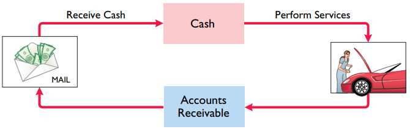
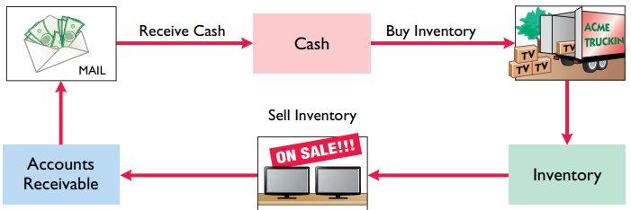
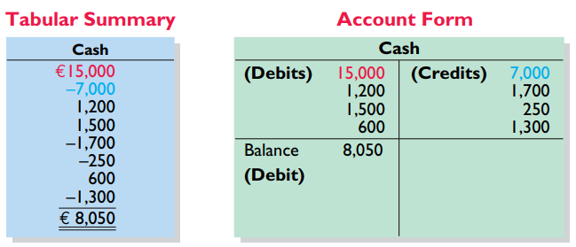
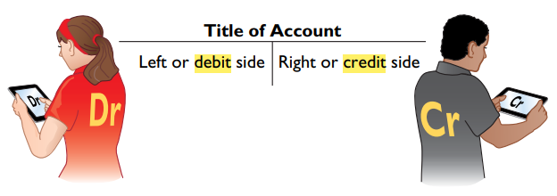

[2. Elements of Financial Position](2.%20Elements%20of%20Financial%20Position.md)
# 1. Introduction

### a. Activities 

> Identification - Recording - Communication

### b. Users

### c. Measurement Principles
1. **Historical cost principle**: Companies record assets at their cost.
2. **Fair value principle**: Assets and Liabilities should be reported at fair value
	1. Revenue recognition principle: 
		1. Only finished things recognize revenue in the period
	2. Expense recognition principle
		1. Expense have to follow revenue
	3. Full disclosure principle
		1. Companies disclose all events, make difference to financial statement user

### d. Assumption

### e. Operating Cycles of Company
- Service Company

- Merchandising Company

### f. Form of Account

The Right side of from is "T-account"

# 2. Element and Analysis

## 1) Asset = Liability + Equity

All asset is belong to creditor or shareholder

1. **Asset**: Capacity to provide future services or benefits
2. **Liability**: Debt and Obligation
	1. Note Payable
	2. Account Payable
	3. Salaries and wages payable
3. **Equity**: Ownership claim on a company's total asset 
	1. Share capital (+): ex - Investments by shareholders
	2. Related Earnings
		1. **Revenue** (+): Gross increases in equity resulting from business activities
		2. **Expense** (-): Cost of assets consumed or Services used in the process of earning revenue
		3. **Dividend** (-): Distribution of cash equivalents to shareholders
		

## 2) Transaction Analysis

## 3) Financial Statement

### 0. Chart: List of elements

### 1. Income 

+) Other Comprehensive income
### 2. Retained Earning 

### 3. Financial Position (+ 178p)

### 4. Cash Flow

 