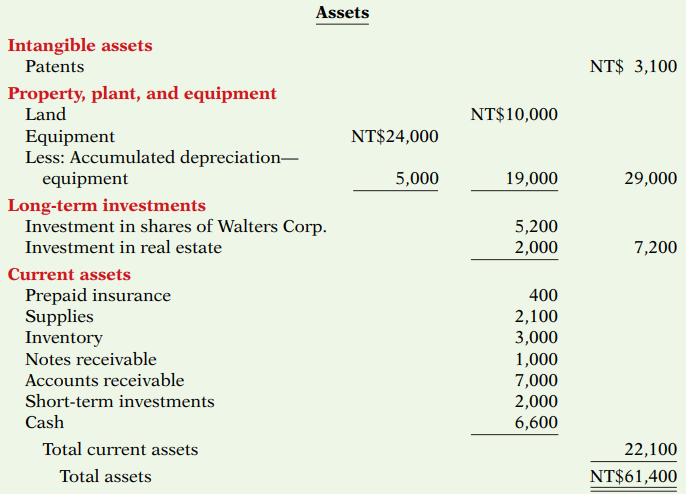
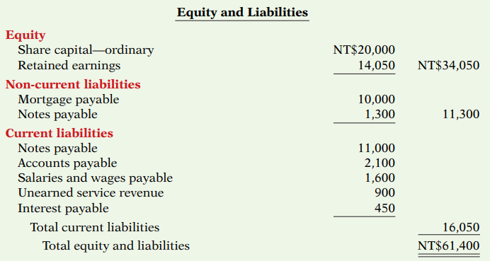

[3. Adjusting](3.%20Adjusting.md)

### Asset

- **Intangible asset** = company's exclusive right of use
	- ex) Goodwill, Patent, Copyright, ...
- **Property, plant, and equipment** with `Depreciation`
	- ex) Land, Building, Structures, Machineary, Vehicles, ...
- **Long-term investment**
	- **Ordinary stock** or **bonds of other companies**, held for many years
	- Non-current asset **not using** in operating activities
	- ex) Investment property, Investments in associates, ...
- **Current asset**: can convert to cash or use within 1 year
	- Prepaid expense: insurance, supply, current tax asset
	- Inventory
	- Trade and Receivable: note receivable, accounts receivable, interest receivable
	- Short-term investment: Derivative financial instrument
	- Cash

### Equity

- (Sole) Proprietorship - one capital account
- Partnership - capital account for each partner
- Corporation
	- **Share capital-ordinary** : Shareholder's investments in the company
		- It's debt on asset account but credit on share capital-ordinary account
	- Share Premium
- **Retained earnings** = operating profit

### Liability
> **Liquidity** means the company is ongoing
- **Current Liability**: pay within the comming year or operating cycle
	- Trade payable
	- Current provision
	- Other current financial liabilities
	- Income taxes payable
	- Current matuirties of long-term debt
- **Non-current Liability**: pay after 1 year
	- Bond payable
	- Mortgages payable
	- Long-term notes payable
	- Lease liability
	- Pension liability
	- Deferred tax liability

+) Major classes of cash receipts and payments 