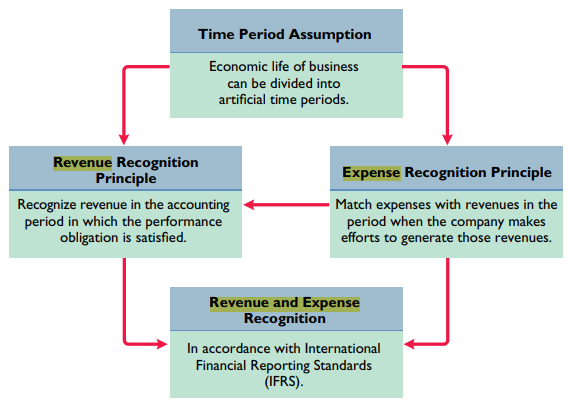
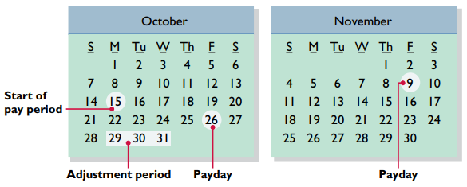

[5. Merchandising Operations](5.%20Merchandising%20Operations.md)
# 1. Issue Time

### a. Timing

| period    | month          | quarter | year        |
|-----------|----------------|---------|-------------|
| so-called | interim period |         | fiscal year |
### b. When to record?

|                | Accural-basis                | Cash-basis             |
|----------------|------------------------------|------------------------|
| what to record | transactions                 | revenue                |
| when to record | in the periods, events occur | the time received cash |

# 2. Adjusting Entries

- `Text` means the state before adjustment
* (-) means overstated, (+) means understated

1. Deferrals
	1. **Prepaid Expense**:  **paid** cash before using
		`Credit in Asset (-) -> Debit in Expense (+)` : `used -> not used`
		1. Type
			1. Supply
			2. Insurance
			3. Depreciation on Equipment (Allocation not Valuation)
				1. keep tracks of total amount of depreciation
				2. consider it as expense
	1. **Unearned Revenue**: **received** cash before performing
		`Debit in Liability (-) -> Credit in Revenue (+)` : `recognized -> unearned`
		1. Type
			1. Rent
			2. Magazine Subscriptions
			3. Customer Deposit for future service
1. Accurals
	1. **Accured Expenses**: yet to **paid** in cash
		`Debit in Expense (+) & Credit in Liability (+)`
		1. Type: Salary, Rent, Interest of Loan
	2. **Accured Revenues**: yet to **receive** in cash
		`Debit in Asset (+) & Credit in Revenue (+)`
		

>**Contra asset account** = accumlated depreciation 
>**Book value** = Equipment value - Contra asset

>Keep pay Calendar!
>
> 

