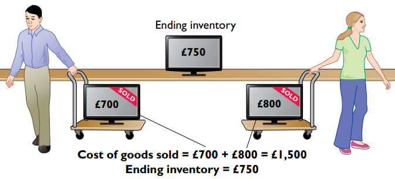
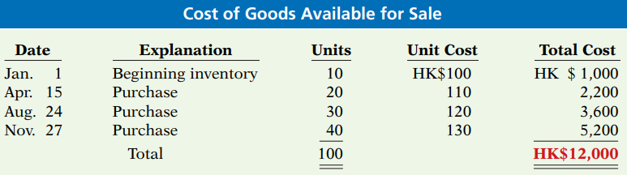
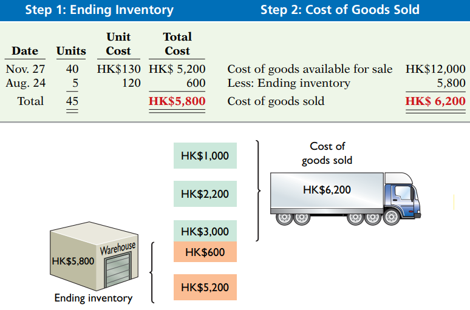
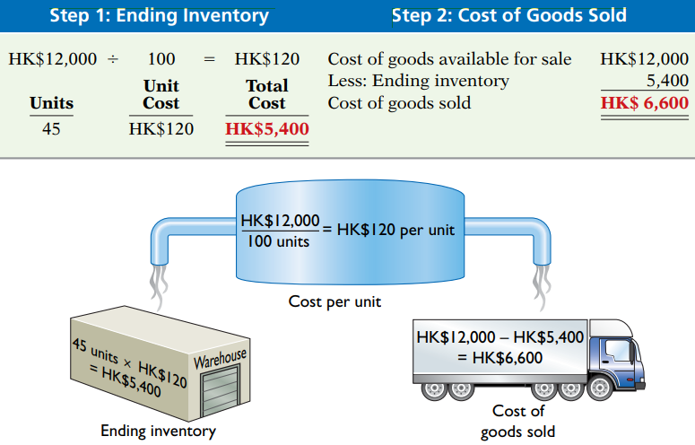
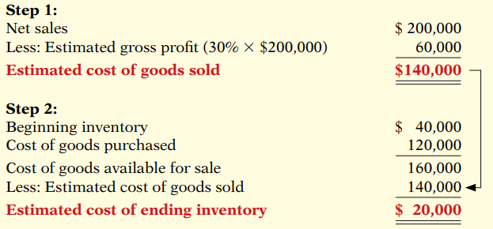
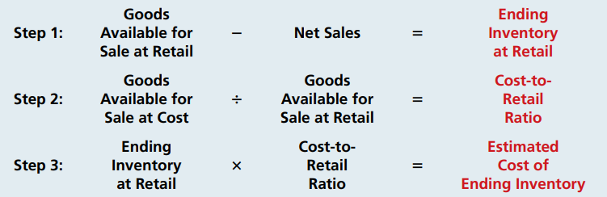
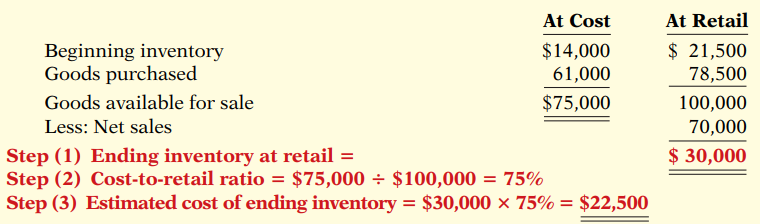

# 1. Classifying Inventory

1.  By step in process
	1. Finished products (= Just-in-time Inventory)
	2. Work in process
	3. (Raw) Materials and supplies
2. By ownership of goods 
	1. Goods in Transit
		1. FOB shipping point
		2. FOB destination
	2. Consigned Goods
		1. hold the goods of others and sell them for others, but without taking ownership
		2. ex) Dealer would not take ownership of the car, it still belong to company.

# 2. Inventory Costing

## 1. Specific identification method

> It is assumption, so it called as *cost flow assumptions*
> There is two type, FIFO and Average-cost
> Before the start, Let the company current goods are below. 
> 

### a. FIFO: First-in, first-out
- Earliest goods purchased are the first to be recognized in determining cost of goods sold.
- In a period of inflation...
	1. FIFO produce a higher net income
	2. $\text{ Cost Allocated to Ending Inventory} \approx \text{Current Cost}$
		1. Be careful this equation may be **understatement**
	

### b. Average-cost
- $\text{Weighted-Average Unit Cost} = \cfrac{\text{Cost of Goods Available for Sale}}{\text{Total Units Available for Sale}}$
- Advantage: **lower** income **taxes** than FIFO

### c. ETC
- Consistency concept
	- A company uses the **same** accounting principles and method **from year to year**.
- LCNRV: Lower-of-cost-or-net Realizable Value 
	- **Realize = Receive**
	- When the value of inventory is lower than its cost,
	- Company must "write down" the inventory to its net relizable value
	- = **Prudence** of accouting
		- the best choice among accouting alternatives is ...
		- the method that is least likely to overstate assets and net income
- Gross Profit Method
	- estimates the cost of ending inventory by applying a gross profit rate to net sales.
		Step 1.  $\text{Net Sales} - \text{Estimated Gross Profit} = \text{Estimated COGS}$
		Step 2. $\text{COG Available for Sale} - \text{Estimated COGS} = \text{Estimated Cost of Ending Inventory}$ 
- Retail Inventory Method
	
	

# 2. On Financial Statement

> COGS = Cost of Goods Sold
## 1. Inventory Error

### a. Income Statement Effect

Formula for COGS = $\text{Beginning Inventory} + \text{Cost of Goods Purchased} - \text{Ending Invectory}$

- A = COGS is understated & Net Income is overstaed
- B = COGS is overstated  & Net Income is understated

| When Inventory Error... | Beginning Inventory | Ending Inventory |
|:-----------------------:|---------------------|------------------|
|       understates       | A                   | B                |
|        overstates        | B                   | A                |

### b. Financial Position Effect

| When Ending Inventory Error is | Asset       | Liability | Equity      |
|:------------------------------:|-------------|-----------|-------------|
|           understated          | Understated | No Effect | Understated |
|           overstated           | Overstated  | No Effect | Overstated  |

## 2. Analysis

### a. Inventory Turnover
the number of times on average the inventory is sold during the period
$= \text{COGS} \div \text{Average Inventory}$ (times)
(unit of duration is "a day")