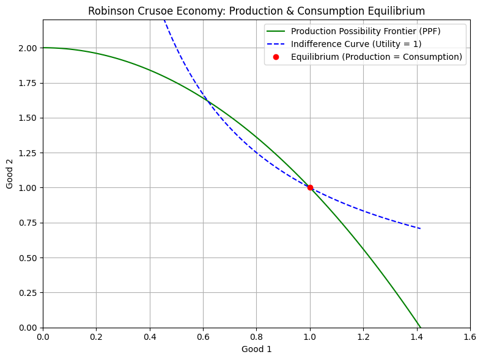
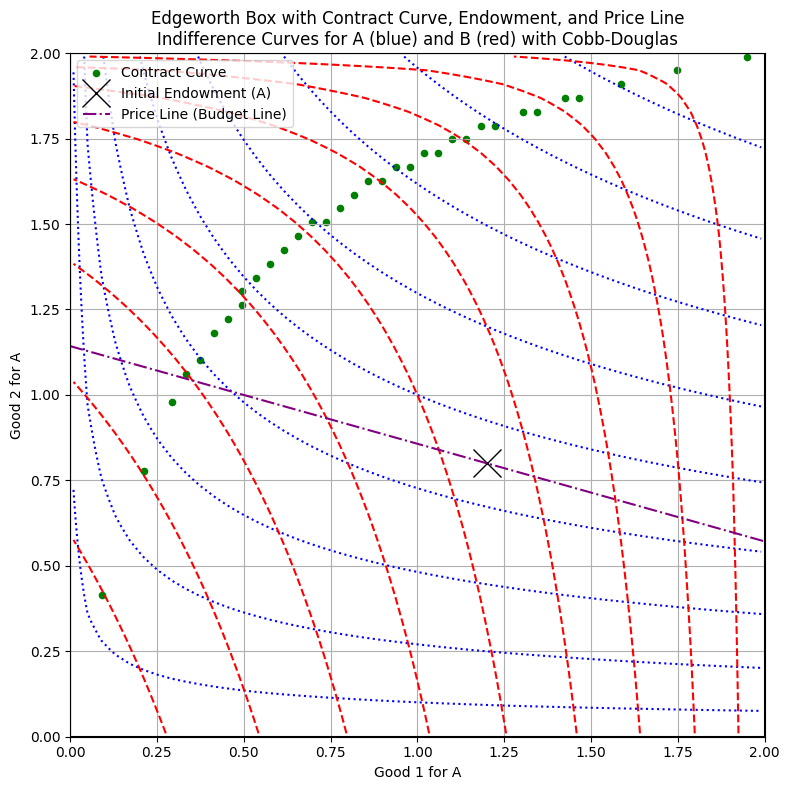

### 📘 2.1 Commodities

* A **commodity** is a homogeneous and infinitely divisible good/service.
* We track them using **N-dimensional vectors** (commodity $n$):

  * **Consumption bundle** $x = (x_1, ..., x_N)$: $x_n \geq 0$
  * **Input-output vector** $y = (y_1, ..., y_N)$:

    * $y_n < 0$: input
    * $y_n > 0$: output
* Sign convention: negative for firm inputs, positive for consumption.

---

### 📘 2.2 Allocations

* An **allocation** $(x, y)$ assigns consumption $x_i$ to each consumer and production $y_j$ to each firm.
* **Feasibility**:

  $$
  \sum_{i=1}^I x_i \leq \sum_{i=1}^I e_i + \sum_{j=1}^J y_j
  $$
    - $e_i$: endowment of the consumer $i$
  
* Examples:
  * Edgeworth Box: Two consumers exchange endowments.
  * Robinson Crusoe economy: One person both consumes and produces
    - $x_{in}-e_{in}>0$: the comsumer is 'net provider'
    - $x_{in}-e_{in}<0$: the comsumer is 'net consumer'
    - $Y=\{(y_{labor}, y_{food}) \ | \ y_{labor} \leq 0, y_{food} \leq f(-y_{labor}) \}$, where $f()$ is production function.

  

---

### 📘 2.3 Utility Functions

* A **utility function** $u: \mathbb{R}^N_+ \rightarrow \mathbb{R}$ represents preferences.
* Properties:

  * Consumers prefer $x \succ y$ iff $u(x) > u(y)$
  * Utility functions are **ordinal**: $u, 2u, \log u$ all express same preference
* **Monotone transformation** $v(x) = f(u(x))$ with $f' > 0$ is valid.
* Visualized using **indifference curves** 

  * consumption combination that gives equal utility

$$
\{x \in \mathbb{R}_+^N \mid u(x) = K\}
$$

---

### 📘 2.4 Economies

* An **economy modeling** for all elements of a static exchange is defined as:

  $$
  \varepsilon = \left((u_i, e_i)_{i=1}^I, (Y_j)_{j=1}^J\right)
  $$

  * $u_i$: utility of consumer $i$
  * $e_i$: endowment
  * $Y_j$: input-output (possibility) set of firm $j$
    * $Y$: is dependent to firm's ability of production technology
    * Free disposability property: the economy can rid itself of surpluses of commodities at no cost
      - $\bf{y} \in Y, \bf{y}' \leq \bf{y} \Longrightarrow \bf{y}'\ \in Y$
* Feasible allocation $(\bar{x}, \bar{y})$ for an economy $\varepsilon$, ***pareto dominates*** an allocation $(x,y)$, if $u_i(\bar{x})>u_i(x_i)$ for some or all $i$.

- Set of feasible allocation: $\mathscr{F}$
---

### (+) Supplements

| Aspect            | Robinson Crusoe      | Standard GE (Edgeworth Box)  |
| ----------------- | -------------------- | ---------------------------- |
| # of agents       | 1                    | ≥2                           |
| Trade             | No external trade    | Agents trade based on MRS    |
| Price system      | Still used           | Essential for coordination   |
| Efficiency result | Utility maximization | Pareto-efficient allocations |

### 2.S.1 Only One Agent in GE

* ✅ **Green Curve (PPF)**: all feasible production combinations of Good 1 and Good 2. Crusoe must choose within PPF curve given his production technology.
* 🔵 **Blue Dashed Curve**: an indifference curve — combinations of goods that give the same utility (Cobb-Douglas with α=0.5 here).
* 🔴 **Red Dot (Equilibrium)**: The point where the **indifference curve is tangent to the PPF**:
  * Here, Marginal Rate of Transformation (MRT) = Marginal Rate of Substitution (MRS)
  * Crusoe's optimal production = optimal consumption
  * **the efficient allocation**

> Even with no trade, 
> efficiency arises because Crusoe chooses a point on the PPF that maximizes his utility, 
> just as a competitive equilibrium would in a multi-agent setting.

### 2.S.2 Standard GE  (Multi Agent)

| Element        | Description                                                                                      |
| -------------- | ------------------------------------------------------------------------------------------------ |
| 🔵 Blue Lines  | Indifference curves of **Consumer A** (Cobb-Douglas utility with α = 0.3)                        |
| 🔴 Red Lines   | Indifference curves of **Consumer B** (Cobb-Douglas utility with α = 0.7)                        |
| 🟢 Green Dots  | **Contract Curve** – Locus of **Pareto-efficient** points where 𝑀𝑅𝑆\_A = 𝑀𝑅𝑆\_B                |
| ❌ Large X    | **Initial Endowment** – The starting point of trade                                              |
| 📐 Purple Line | **Budget Line** – All combinations affordable to A given the price ratio                         |
|   Intersection    | **Market Equilibrium** – The efficient point where the **budget line intersects contract curve** |

> Consumers **A** and **B** begin with an **initial endowment** (❌), which represents their original share of the two goods.
>
> They engage in **voluntary trade**, guided by **market price signals** (reflected in the slope of the 📐 **budget line**).
>
> The trade continues **until they reach a point** where:
> * Their **indifference curves are tangent** (same marginal rate of substitution), and
> * The point lies **on the budget line**,
>
> resulting in a **Pareto-efficient market equilibrium**

