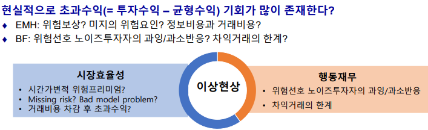
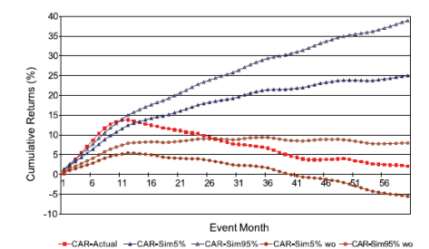
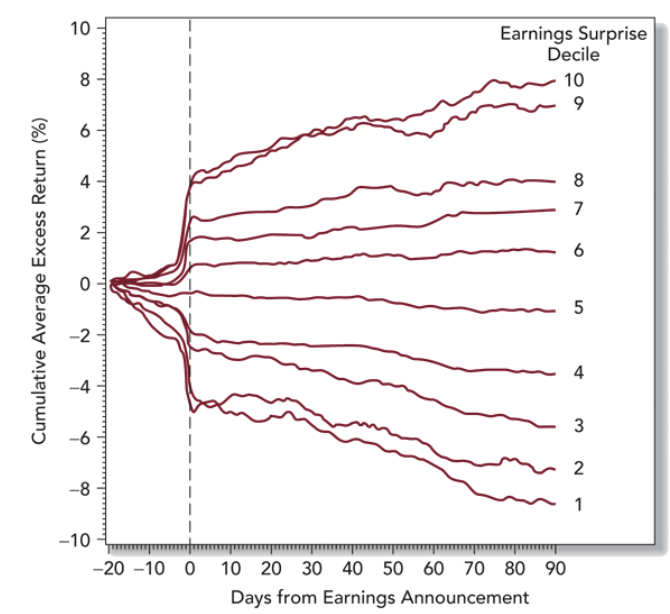
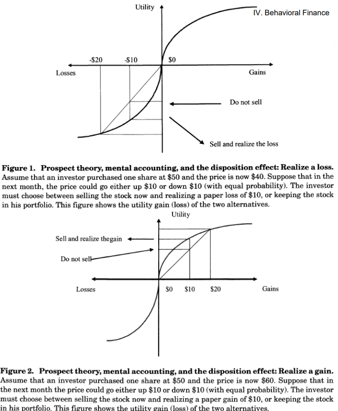
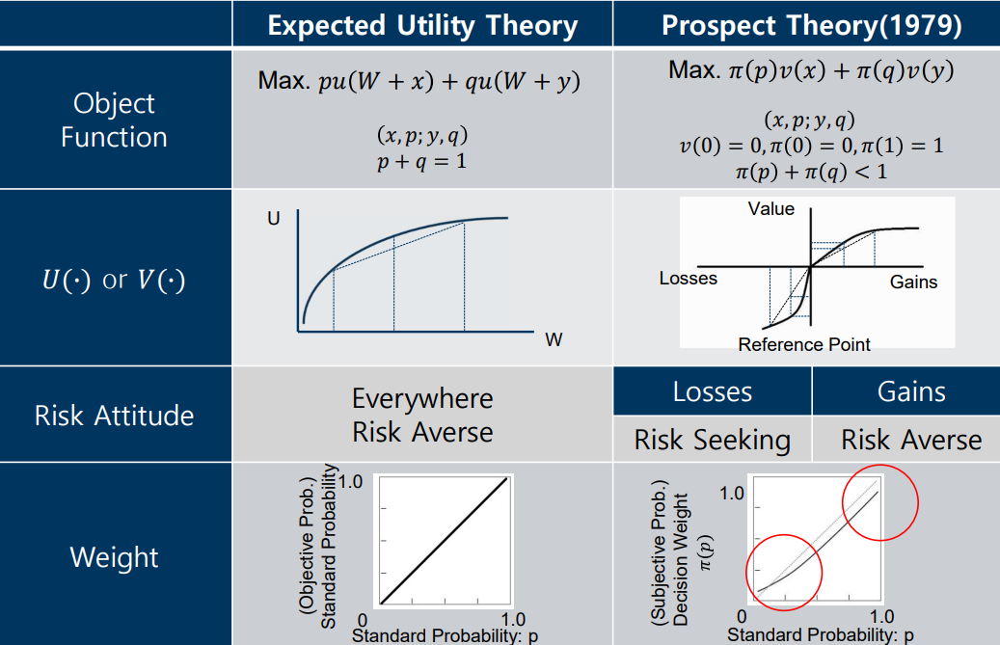
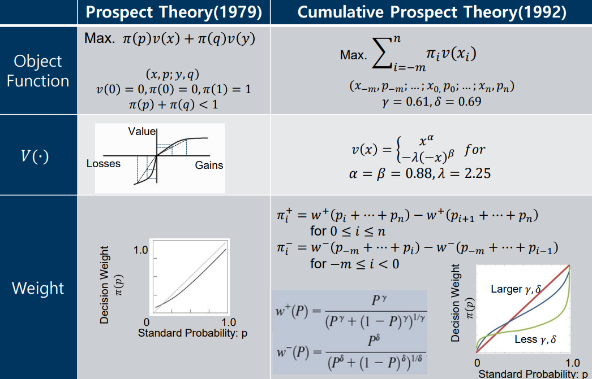

# 5-1. Efficient Market Hypothesis (EMH)

- 효율적 시장가설의 의미는 무엇이며, 투자론 및 기업재무에 대한 시사점은 무엇인가?
	- Efficient Market Hypothesis
		- 증권의 가격은 관련된 정보를 완벽히 그리고 즉시 반영하는가
	- Implication for investment
		- Cannot beat the market consistently over time. EMH에서 초과수익을 얻을 수 없다.
		- Passive (buy & hold) outperforms Active (market timing & stock selection)
			- Passive는 semi-strong EMH
			- Active는 inefficient market을 가정
	- Implication for corporate finance
		- positive NPV를 찾기 어우며 쉽게 사라진다.
	- Portfolio managers in EMH?
		- Identify the **tangent(market) portfolio** on the efficient frontier (Two-fund separation theorem)
		- Combine it with $R_f$, which satisfies the investor's **risk aversion**
		- **Tax** consideration

- 투자성과
	- 3대 요소
		- 자산배분
		- 종목선택
		- 시장타이밍
	- 전략적 자산배분: 장기 벤치마크를 목표로 (Markowitz 포트폴리오 이론)
	- 전술적 자산배분: 주기적인 시장등락에 대응하여 허용범위 내에서 자산배분 비중 조절

- 투자수익률 분해
	- $R_i=R_b+[R_i-R_b]$
		- 패시브전략(benchmark 추종) + 액티브전락(alpha)
		- 전략적 자산배분 + "시장타이밍 + 종목선택"
		- $R_b + [R_{timing} + R_{selection}]$
		- $\Sigma^n_j w_j^bR_j^b + [\Sigma^n_j (w_j-w_j^b) R_j^b + \Sigma^n_j w_j(R_j-R_j^b)]$
	

- 효율적 시장 가설과 랜덤워크 가설과는 어떠한 차이점이 있는가?
	- 공통점은 unpredictable
	-  Martingale이 되려면, "도무지 알 수가 없어!" 라고 말해야 하는데 주가의 경우 " 이 방향으로 가야할 것 같은데 알 수가 없어" 라고 말할 수 있기 때문이다.
	- RW는 $E(R_{j,t+1})=0$이란 강한 가정을 갖고 있다.
	- 그에 반해 EMH는 $E(R_{j,t+1})>P_{j,t}$ or $E(R_{j,t+1})>0$가 성립함으로서 risk compensation을 한다.
	- 그러므로 주가는 양의 기대수익으로 예측가능하다.
	- EMH allows RW with "positive" drift

- EMH 3가지
	- Weak form efficiency: past market data
	- Semi-strong: public information
	- Strong: private information

- 초과수익 기회가 있을 때, 이를 이상현상(anomaly)으로 판단하기 전에 EMH 입장에서 체크해야 할 것은 무엇인가?
	- 

- Possible explanation for the profit with in EMH?
	- Compensation for the risk (taken by the trading rules)
	- Bad model problems (in computing abnormal returns)
	- After transaction costs, (many of abnormal returns disappear)

- 모멘텀과 콘트라리언 현상이 발생하는 이유를 EMH 입장에서, 그리고 행동재무 입장에서 각각 설명해보시오.
	- Market efficiency supporters
		- Time-varying risk premium
		- Transaction costs
		- Industry effect
	- Behavioral bias
		- Continued overreaction
		- Underreaction to news
	- 올라갈 때는 momentum, 꺾이면 contrarian? 

- 준강형 및 강형 EMH에 위배되는 현상들로서 어떠한 것들이 있으며, 이들의 발생 이유와 시사점을 각각 설명해보시오.
	- Semi-strong: information leakage prior to announcement
		- Takeover announcements: 피인수기업 초과수익률 증가
		- PEAD(Post-earnings announcement drift)
			- Decile portfolios based on earnings surprise (shock): 
			- $SUE_{i,t}=\cfrac{EPS_{it}-\hat{EPS_{it}}}{\sigma_{it}}$
				- Standardized Unexpected Earnings
				- $\hat{EPS_{it}}$: 애널리스트 예측치 (컨센서스)
				- $\sigma_{it}$: 컨센서스의 표준편차
			- 이익 조정(earning management)할 때 더 커짐. 이는 재량적발생액(discretionary accruals)과 관련됨
			- surprise 중에서도 intangible capital이 많으면 delay effect도 커지더라 
		- Stock splits
			- 주식분할 자체가 기업가치를 더해주진 않지만
			- 주가가 많이 오른 기업이라서 주식분할을 하는게 아닌가 하는 생각때문에 주가가 오름
			- Liquidity provision: 쉽게 살 수 있어서 주가가 더 오르지 않을까 하는 생각때문에
			- Information signaling on dividends: 배당 주지 않을까 해서
		- Small firm effect (January effect)
			- Small firm gives higher return
				- Size premium: Risk compensation due to higher risk of neglected firms
				- High trading costs
				- Lower liquidity of small firms
			- January effect
				- Tax-loss selling hypothesis
		- Book-to-Market ratios
			- Risk premium on distressed firms
			- Firms characteristics
		- Earnings-to-price ratios
		- Cash flow-to-price ratios
		- Dividend-to-price ratios
	- Strong
		- Those who has superior information not available to public investors
			- Security analyst
				- 대부분 buy로 치중되어 믿을만 하지 못하지만, sell이 나온다면 부정적인 정보를 의미한다는 것은 확실하다.
				- information superiority인지 price pressure인지 분간하기 어려움
				- Fair disclosure rule(공시제도) 후에 그들이 가진 정보력은 약해졌지만 남아있다.
			- Do precise earnings forecast lead to higher profits?
				- No, due to the conflict of interest
			- Fund Manager
				- Not have on average
					- their average alphas are close to zero, and do not appear to outperform the market index
				- Superstar phenomenon
				- Style adjustment is needed 
			- Insider trading: 내부자 거래
				- 

- Earnings opacity
	- 회계 이익과 경제적 이익 간의 괴리 정도
		- Earnings aggressiveness $\cfrac{Acc_t}{Asset_{t-1}}$
			- 단기에 쌓은 accrual 많을 수록 aggressive 하다고 봄
		- Loss avoidance (small positive - small negative)
			- 약간의 손실은 이익으로 수정하더라
		- Earnings smoothing (Correlation between $\Delta Acc$ and $\Delta CF$)

- EMH 실험의 함의점
	- Technical analysis
		- 주식은 RW가 아니기에 TA가 될 것 같지만 많은 거래 비용으로 인해 수익을 거둘 수 없다.
	- Fundamental analysis
		- 불일치하는 비율들을 통해서 misspecified risk와 관련된 수익을 잡아낼 수 있다.
		- 그렇지 않으면 시장은 분명히 비효율적일 것이며 적어도 심각하게 고평가된(overvalued) 투자를 피하는 데 도움이 될 수 있습니다
	- Speculative bubbles
		- 버블이라고 하면, 내재가치에서 벗어나지만
		- 실상은 지금 버블에 와있는지 언제 터질지 모른다.
	- Are the abnormal returns evidence for risk premiums or market inefficiency?
		- Anomaly 예시
			- Small-firm effect, BTM ratio, momentum, long-term reversals(contrarian), PEAD
		- 왜 anomaly가 지속되는가?
			- Risk compensation
			- Time-varying risk premium
			- model risk
			- high transaction cost
			- behavioral explanation
			- Inefficiency exists due to noise trader
			- Limits of arbitrage

# 5-2. Behavioral Finance

- 투자자들의 대표적인 행동 편의 세 가지를 설명하시오.
	- Representativeness heuristic
		- overweight recent evidence -> overreaction
	- Conservatism (or Anchoring)
		- underweight recent evidence -> underreact to new information but overreact when repeated
	- Framing errors
		- Mental Accounting
			- When cash is needed, investors may spend dividends, but refuse to sell even a small portion of stock
		- Loss Aversion(Prospect Theory)
			- Regret from losses is greater than joy from gains

- 로또타입주식은 어떠한 특성을 갖는 주식인가?
	- 특성: low price, high volatility, high positively skewness
	- 예시: IPO stocks, distressed stocks, lottery-type stocks
	- 비고: CPT agent가 좋아함

- 전망이론의 핵심적인 주장으로서 손실회피와 처분효과(disposition effect)에 대하여 설명하시오.
	1. 하방압력으로 서서히 주가 상승 (지연효과)
	2. hold하고 있어서 서서히 주가 감소 (지연효과)

|          | 이익       | 손실       |
| -------- | -------- | -------- |
| 실적 서프라이즈 | PEAD$^1$ |          |
| 실적 쇼크    |          | PEAD$^2$ |

- 이상현상들이 지속되는 이유에 대하여 행동재무에서는 차익거래의 제약을 들고 있는데 이에 대해 설명하시오.
	- 차익거래: 저평가 주식 매입 & 고평가 주식 공매
	- 현실적 제약
		- fundamental risk: 평가 대상 자산의 내재가치가 변동할 위험
		- implementation costs risk: 매매수수료, 공매비용, bid-ask spread 등 
		- model risk
		- noise trader risk: 노이즈 투자자가 만들어 놓은 과대평가가 언제 소멸하게 될지 불확실한 위험
		- rational bubble: 합리적 투자자들도 수익 극대화를 위해 버블에 편승할 수 있음

- 노이즈트레이더 리스크란 무엇인가?
	- 

- EUT vs PT 
- PT vs CPT 

- Low volatility Puzzle
	- 저변동성 주식군의 특성
		- 주로 매매회전율이 낮은 소외된 대형주 & 저PRB 가치주 or 과거 수익률이 높은 승자주식
		- 가치주 전략, 모멘텀 전략과 연관됨
	- 원인
		- Noise trader의 로또와 같은 복권주식을 선호하는 투기 심리가 작용된 결과
		- 기관투자자 입장에서도 이러한 이상현상을 적극적으로 활용하여 차익거래할 인센티브가 크지 않음.
		- 기하평균 = 산술평균 - (변동성)^2/2
- Idiosyncratic volatility anomaly
	- CAPM: 특이적 위험이 분산 가능하기 때문에, 체계적 위험만이 가격에 반영되어야 한다.
	- 투자자가 친숙한 위험-수익 특성을 가진 증권에만 투자하고, 과소분산된 포트폴리오를 유지하는 경우, 특이적 위험이 가격에 반영될 수 있다. EU에서 오목한 효용 함수를 가진 위험 회피 투자자는 특이적 위험에 대한 양의 변동성-수익 관계를 가질 수 있다.
	- 즉, **하위 최적 분산 투자와 긍정적인 변동성-수익 관계** (positive volatility-return relationship with suboptimal diversification)
	- 손실 영역(Prospect Theory)에서의 위험 추구 행동은 높은 특이적 변동성을 가진 주식을 선호하게 하며, 이는 미실현 자본 손실을 가진 높은 특이적 변동성 주식의 낮은 수익으로 이어짐. 따라서, 특이적 변동성과 이후 주식 수익 간의 음의 관계는 미실현 자본 손실을 가진 주식에 집중됨.