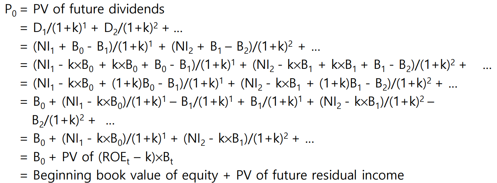
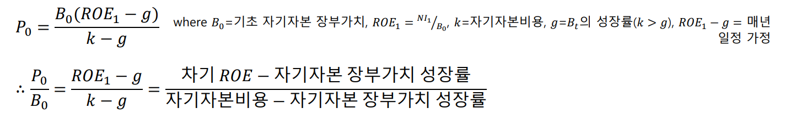
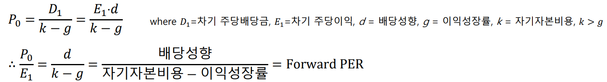
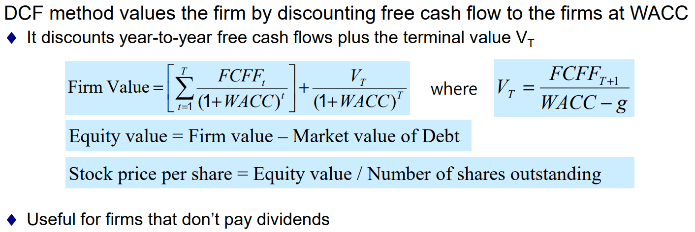
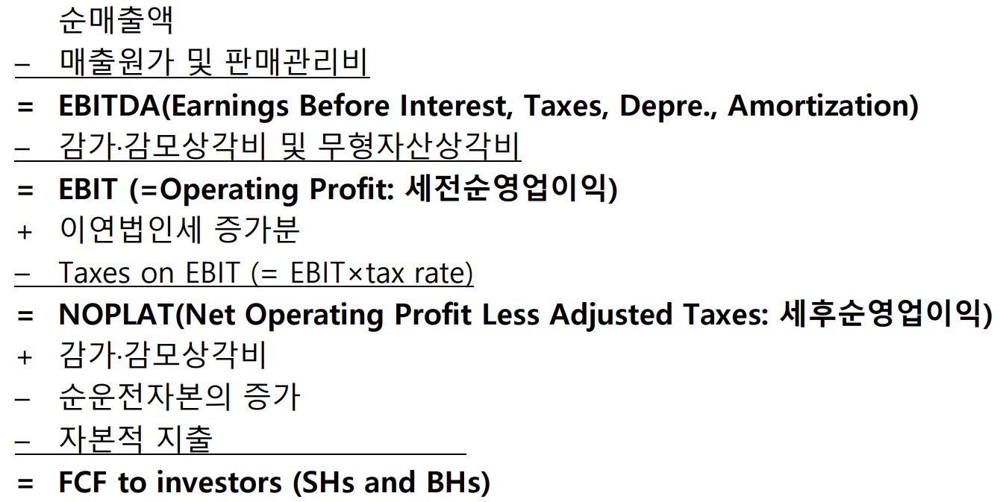
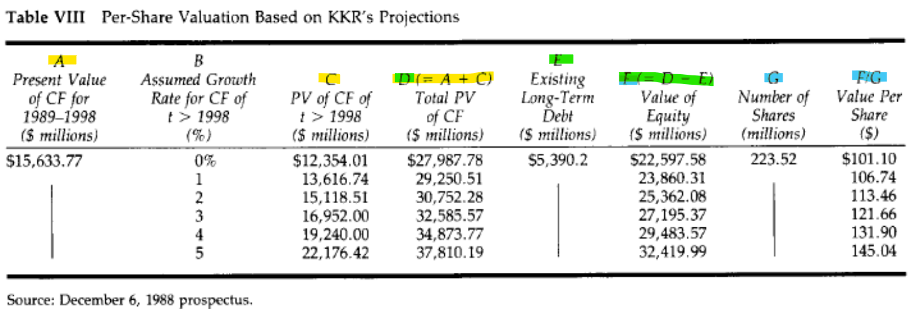

# 6-1. Macroeconomic and Industry Analysis

- 주식의 내재가치 측정을 목적으로 하는 증권분석(기본적 분석과 기술적 분석)에 대하여 설명하시오.
	- Technical analysis: Timing to buy or sell
	- Fundamental Analysis: Stock selection
		- Macroeconomic Analysis (Big-picture)
		- Industry Analysis
		- Firm-level Analysis

- 거시경제변수와 경기변동에 대하여 설명하시오.
	- Variables
		- GDP
		- Inflation
		- Interest rates
			- CPI, PPI, GDP Deflator
		- Budget deficit
		- Consumer sentiment
	- Recurring patterns of recession & recovery, peack & trough

- 산업분석과 섹터로테이션에 대하여 설명하시오.
	- Buisness cycles
		- Cyclical industry: sensitive (high beta)
			- Consumer durables (appliances, autos, and luxury items)
		- Defensive industry: (low beta)
			- Food producers, Pharmaceutical firms, public utilities
	- Sector Rotation
		- Trough -> Expansion -> Peak -> Constraction

# 6-2. 배당할인모형(DDM: Dividend Discount Method)

- 주가 예측이 가능한가?
	- 위험-기대수익 비례관계에 따라 위험자산일 수록 positive risk premium이 주어져야 한다.
	- 시장 참여자들은 기업 실적에 대한 예측이 어느 정도 가능하며 positve risk premium을 기대하고 투자한다는 점에서 우상향 추세를 갖는 random walk 형태를 나타낸다.

- 주식의 내재가치와 시장가격 간의 관계에 대하여 설명하시오.
	- 주가는 내재가치와 유사하다. 기업의 미래 현금흐름을 투자자 요구수익율이 반영된 할인율로 할인한 현재가치로 본다면.
		- 투자자 요구수익률 $k = R_f$ + risk premium (by CAPM & APT)
		- Intrinsic Value (Fair Value): $V_0 = \cfrac{E(D_1)+E(P_1)}{1+k}$
			- = PV of a firm's future cash flows discounted by the required rate of return
		- Market Price: $P_0$ Consensus value of all traders
			- In equilibrium, $V_0=P_0$

- Gordon's Dividend Discount Model
	- $P_0 = \cfrac{D_1+P_1}{1+k}$ if holding in one period
	- $P_0 = \cfrac{D_1}{1+k} + \cfrac{D_2+P_2}{(1+k)^2}$ if holding in two period
	- $P_0 = \Sigma^{\inf}_{t=1}\cfrac{D_t}{(1+k)^t}$ if holding infinitively	
- Zero Growth Model
	- $P_0 = \cfrac{D_0}{k}$  (using $D_0=D_1$)
		- $k = \cfrac{D_0}{P_0}$ = cost of equity = dividend yield at 0 
	- ex) Preferred stock
- Constant Growth Model
	- $D_1=D_0(1+g)$ where $g$ is constant growth rate
	- $P_0 = \cfrac{D_1}{k-g}$ if $k>g$
		- $k=\cfrac{D_1}{P_0}+g$ = cost of equity = dividend yield at 1 + growth rate

- 배당할인모형에서 제로성장의 경우보다 일정성장의 경우 더 높은 값을 얻게 되는데, 그 차이는 무엇을 의미하는가?
	- growth rate가 커질 수록 price는 상승하는 constant growth model

- $g = b \times ROE$
	- Proof
		- $E_{t+1} = E_t + RE \times ROE$
		- $\cfrac{E_{t+1} - E_t}{E_t} = \cfrac{RE}{E_t} \times ROE$ 
		- where E is earnings, RE is retained earnings

- 내부유보를 통한 투자로부터 가치창출이 있기 위해서는 어떠한 조건을 만족시켜야 하는가?
	- 성장률에서 외부자금 의존부분을 차별화하는 것이 필요함 (줄이기)
	- **매출액순이익률**과 **자산회전율**이 높을수록 지속가능 성장률이 높다
	- $g = b \times \left( \frac{NI}{Equity_{t-1}} \right)$
		- $= b \times \left( \frac{NI_t}{Sales_t} \right) \times \left( \frac{Sales_t}{Asset_t} \right) \times \left( \frac{Debt_t}{Equity_t} + 1 \right) \times \left( \frac{Equity_t}{Equity_{t-1}} \right)$
		- $= 내부유보율 \times 매출액 상 이익률 \times 자산회전율 \times (레버리지 + 1) \times 자기자본 증가율$

- 배당할인모형의 (practical) 한계점에 대하여 설명하시오.
	- Some firms do not pay dividends
	- Impossible to predict future dividends
	- Impossible to predict the terminal liquidation value $P_T$
	- Varying discount rate $k$
		- Rely on the CAPM or APT?
		- Flat term structure or upward sloping curve?

- Residual Income (or excess income)
	- = Net income - 'Normal' expected income
	- = Net income - Cost of equity capital $\times$ Book value of equity
		- Book value of equity: accumulated investment base
	- $NI_t - KB_{t-1} = (ROE_t-k)\times B_{t-1}$ where $ROE_t = NI_t/B_{t-1}$
		- $ROE_t -k$:  excess profitability
	- High dividend reduces growth in the book value of equity
		- $\Delta B_t = B_t-B_{t-1} = NI_t - D_t$

- 배당할인모형과 초과이익모형(RIM)의 관계에 대하여 설명하시오.
	- DDM focuses on wealth **distribution**, whereas RIM focuses on wealth **accumulation**
	- 
- 
    If $\text{ROE}_t - k = 0$ (or future $\text{RI} = 0$) $\Rightarrow \text{PBR} = 1$
    If $\text{ROE}_t - k > 0$ (or future $\text{RI} > 0$) $\Rightarrow \text{PBR} > 1$ (growth firm)
    If $\text{ROE}_t - k < 0$ (or future $\text{RI} < 0$) $\Rightarrow \text{PBR} < 1$ (value firm)

	$\text{ROE} = \frac{E}{B} = \frac{P/B}{P/E}$

# 6-3. 상대가치법(Price Multiples)

- 초과이익모형에 의하면, 초과이익 여부에 따라 PBR 값은 어떻게 다르게 되는가?
	- RIM can be used to express PBR as follows
	- $P = B+PV \ \text{of} \ (ROE_t - k) \times B$

- **PBR** = f(ROE, 자기자본성장률, 자기자본비용) with **RIM**
	- By RIM 
		- $ROE_1>k$이면, $PBR>1$ => 성장주 (배당⋅자사주매입보다 기업 투자와 성장이 가치창출) 
		- $ROE_1<k$이면,  $PBR<1$ =>가치주 (배당⋅자사주매입이 기업 투자보다 유리)
	- 관계성
		- **수익성**(ROE)이 높을수록, PBR이 높아짐 
		- **자기자본성장률**(g)이 높을수록, PBR이 높아짐
		- **자기자본비용**(k)이 낮을수록(저위험 기업), PBR이 높아짐

- PER = f(배당성향, 이익성장률, 자기자본비용) with DDM
	- BY constant growth DDM 
	- 관계성
		- 배당성향(d)이 높을수록, PER는 높아짐
		- 이익성장률(g)이 높을수록, PER는 높아짐
		- 자기자본비용(k)이 낮을수록(저위험 기업), PER는 높아짐

- 배당할인모형에 의하면, PER을 결정하는 요인들은 무엇인가?

- PER에 의한 상대가치평가의 한계점에 대하여 설명하시오.
	- PER != Growth opportunity
		- PER이 산업별로 다름
		- 성숙 산업에서 낮은 PER
		- Growth가 다음 해의 EPS인지, 역사적으로 평균 EPS인지 장기 EPS인지
	- Earning management causes a serious problem
		- 보고의 유연성으로 인해 수익 선택이 어려워 적정 EPS 배수를 평가할 수 없음
	- Reported PER commonly use the most recent past earnings
		- 12-month forward EPS 
		- 12 month (TTM) EPS - TTM: trailing twelve months

- 마이크로소프트의 2008년 수익성은 업종평균 이상이었지만 상대가치는 평균 이하였다면, 저평가된 것으로 볼 것인가?
	- 마이크로소프트의 가치 평가 비율이 업계 평균보다 낮은 반면, 수익성 비율은 업계 평균보다 높다는 점을 고려할 때, 마이크로소프트는 저평가되어 있을 가능성이 있습니다. 
	- 이러한 저평가는 잠재적으로 매력적인 투자 기회를 제공할 수 있습니다. 회사의 강력한 수익성과 낮은 상대적 가격은 시장이 마이크로소프트의 재무적 강점을 충분히 반영하지 못하고 있음을 나타냅니다.

- <부록1> Piotroski의 재무제표 기반 가치투자전략에 대하여 설명하고, 최근 유용성이 감소한 이유를 설명하시오.
	- **시장 효율성 증가**:  정보 기술의 발전과 데이터 분석 도구의 발전으로 인해 투자자들은 더 빠르고 정확하게 정보를 이용할 수 있게 되었으며, 이에 따라 저평가된 주식을 찾기가 어려워졌습니다.
	- **전략의 보편화**
	- **회계 기준 및 기업 보고의 변화**
	- **거시경제 요인**
	- **기술 및 산업의 변화**

- <부록2> 무형자산에 대한 가치평가가 중요해지면서 회계정보의 유용성이 하락하는 이유에 대하여 설명하시오.
	- 무형자산의 인식 및 측정의 어려움
	- 무형자산의 비가시성
	- 무형자산의 가치 변동성
	- 전통적인 회계의 한계
	- 투명성 및 신뢰성 문제
	- 비재무적 정보의 중요성 증가

# 6-4. 현금흐름할인법(DCF: Discounted Cash Flow Method)

- 현금흐름할인법의 평가과정을 단계별로 설명하시오.
	- DCF 현금흐름할인법
	- FCF 잉여현금흐름 

- 주식가치 평가실무에 있어서 모형에 따라 평가결과의 차이가 발생하는 것에 대하여 어떻게 대응해야 하겠는가?

- RJR Nabisco가 LBO의 좋은 타겟이 되었던 이유는 무엇인가?
	- 담배, 식품 사업은 체계적 위험에서 자유롭고 꾸준한 성장성
	- 자산건전성과 낮은 부채 비율 -> 추가 차입 여력 풍부
	- 비용절감을 통한 수익성 개선 가능성
		- 경영진 사치, 행사와 이벤트 중지 등
	- 분할매각 가치 > 현재 주가 (저평가)

- General Sources of LBO gains 
	- 경영권 프리미엄
	- 부채의 절세효과
	- 시너지 효과
	- 과열된 인수경쟁에 의한 과대평가: Hubris

- RJR Nabisco’s LBO 사례에서 채권자의 부가 주주의 부로 이전된 이유는 무엇인가?
	- 채권 가격이 급락하고 주가는 급등
	-  최종으로 결정된 회사가 너무 값을 높게 치뤘으며 그만한 부채(채권)을 감당할 여력이 될 지 의심하는 채권자가 많았기에 하방 압력이 쏟아졌다.

- RJR Nabisco’s LBO 사례에서 DCF에 의한 평가과정을 단계별로 설명하시오. 