# 7-1. 채권가격과 만기수익률

- 주식과 채권의 차이점에 대하여 설명하시오.
	- 만기 없음 (영구 자본)
	- 배당 지급
	- 원리금 상환 조건 없음
		- 채권자 지분 상환 이후 남는 residual claim(잔여지분 청구권)

- 채권 가격 $P_0 = [ \sum_{t=1}^{m \times T} \frac{C_t}{(1 + y/m)^t} + \frac{F}{(1 + y/m)^{m \times T}} ]$
	- 만기 $T$년, 이자 $C$, 할인율 $y$ = YTM, Number of compounding periods per year $m$
	- 채권을 만기까지 투자할 경우 얻는 연평균 수익률(내부수익률) 의미를 가짐
- YTM = 국채 만기수익률(무위험 수익률) + Credit spread
	- credit spread = 채무불이행 위험 프리미엄 + 만기 위험, 유동성 위험 등의 프리미엄

- 채권의 가격과 만기수익률의 관계에 대하여 설명하시오.
	1. 비선형 반비례
	2. Convexity: 이자율 하락으로 인한 가격 상승폭 > 같은 폭의 이자율 상승으로 인한 가격하락폭
	3. 채권만기 길수록 -> 이자율 변동에 대한 가격변동폭 커짐
		1. but 증가율은 체감함
	4. 이표가 높을 수록 -> 이자율 변동에 대한 가격변동폭 적어짐
	
	- 

- 채권을 액면 발행하기 위한 조건을 설명하시오.
	- 표면이자를 시장에서 형성된 만기수익률과 일치하게 발행해야 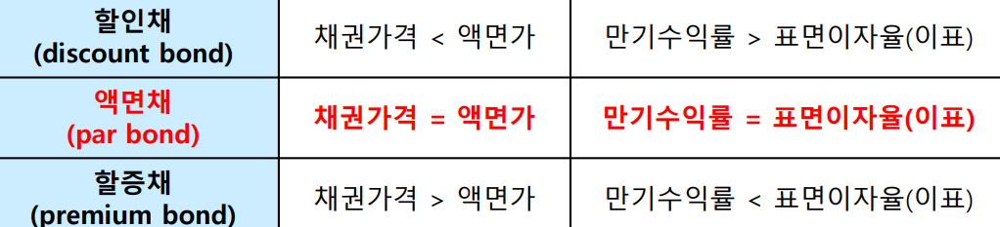 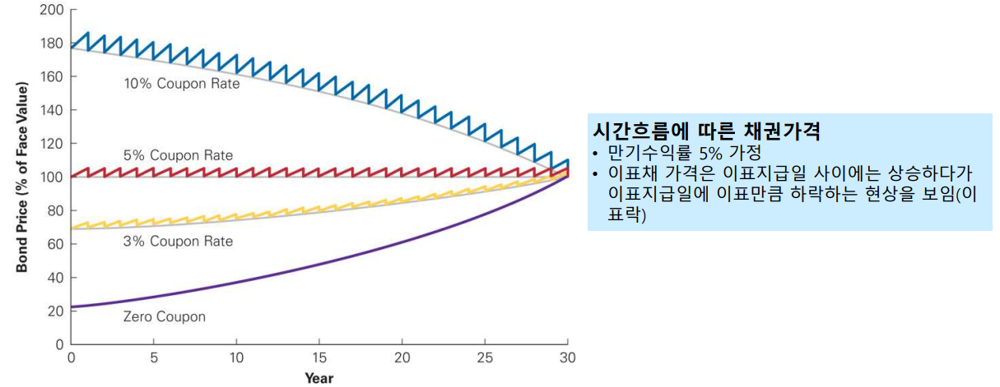

- Callable bond와 putable bond는 어느 상황에서 조기상환 가능성이 높아지는가?
	- Callable bond 가치 = Straight bond 가치 - Call option 가치 (발행자 보유)
	- Putable bond 가치 = Straight bond 가치 - Put option 가치 (투자 보유)

- 채권의 만기수익률을 결정하는 주요 요인들은 무엇인가?
	- 만기 수익률 = 무위험 이자율 + 위험 프리미엄
	- 위험프리미엄 (기대 손실률) = 부도확률 x (1 - 회수율)
	- 내적요인
		- 잔존만기
		- 액면 이자율
		- 채무불이행 위험, event risk 등
	- 외적요인
		- 경기동향: 경기상승->기업수익호전->소비,투자증가->자금수요증가->금리상승,물가상승
		- 재정정책: 경기부양정책->내수확대->경기상승->장기금리상승
		- 금융정책: 재할인율 인하->화폐공급증가->자금초과공급->금리하락
		- 환율변동
		- 채권수급동향

- 신용위험(부도위험)에 대응하기 위한 수단을 설명하시오.
	- 채권계약서(bond indenture)에서 채권자보호를 위한 조항
	1. Sinking funds (감채기금)
		- 발행자는 매년 발행된 채권의 일정 비율을 다시 살 수 있음
		- 시장가격이나 사전에 정한 call price 중 낮은 가격으로 채권을 매입할 수 있으며, 보통 액면가임.
		- 회사는 시장 가격에서 할인된 채권 매입 or 액면가에서 프리미엄 채권을 매입 (채권보유자 손실 발생)
	2. Serial bond
		- 만기 날짜가 차례로 정해져 있어, 원금 상환 부담이 시간에 따라 분산됨.
	3. Subordination of future debt
		- 추가 채무가 기존 채무보다 우선순위에서 밀리도록 
		- 파산 시 선순위 채권자가 먼저 전액 상환 받음
	4. Dividend restriction
		- 배당금 지급에 제한 -> 회사의 유동성 유지
	5. Collateral
		- 특정 자산을 담보로 제공 -> 채권 발행 시 만약의 채무불이행에 대비

#  7-2. 채권시장과 채권종류별 특징

- 채권의 발행자, 투자자, 자본시장의 측면에서 그 의의를 설명하시오.
	- 발행자 측면 (기업, 정부)
		- 채권=타인자본
		- 이점
			- 주식보다 저렴한 외부자금 조달원
			- 이자비용의 절세효과(interest tax shields)
		- 단점
			- 부채가 많아질 수록 파산 비용과 대리인비용이 커짐
		- 최적부채비율을 찾아라
	- 투자자 측면
		- 시장 금리변동과 채권가격은 역의 관계
		- 미리 금리변화에 대한 채권가격 변화는 duration과 convexity로 근사 예측
	- 자본시장 측면
		- 다양한 미래 수익구조를 갖는 결합상품을 통해 자본시장의 completeness에 기여 (ABS, ELS)
		- 금리파생상품을 통해 미래 금리변화에 대한 헤징, 차익, 투기거래가 가능해짐

- 채권의 종류
	- 이자지급방법에 따른 분류
		- 순수할인채:pure discount bond or zero-coupon bond
		- 이표채: coupon bond
		- 복리채: compound bond 이자를 복리 재투자하여 만기에 원리금 일 시 지급
		- 단리채: 단리이자를 가정하여 만기 원리금 지급
	- 액면이자 확장 여부에 따른 분류
		- 고정금리채
		- 변동금리채(FRN): floating rate note
			- 액면이자 = 기준금리 + 가산금리
		- 역변동금리채: Inverse FRN
			- 액면이자 = 12% - 기준금리
	- 보증유무에 따른 분류
		- 보증사채: guaranteed bond
		- 무보증사채: straight bond
		- 담보부사채: secured bond, mortgage bond, collateral bond
	- 옵션부 채권
		- 수의상환사채(callable bond): 
			- 발행자가 만기 이전 상환 가능
			- 기존의 높은 금리 채권을 낮은 금리 채권으로 차환발행하고자 할 경우 사용됨
			- 투자자는 이에 대해 높은 YTM 요구
		- putable bond
			- 채권자가 만기 이전에 상환 요구 가능
			- 기존의 낮은 금리 채권을 높은 금리 채권으로 대체하여 투자할 경우 사용됨
		- 주가연동 옵션부채권
			- CB: Convertible bonds
			- BW: bonds with warrants, 신주인수권부사채
				- 유상으로 신주을 인수할 권리가 부가된 사채채
			- EB: Exchangeable bonds
				- 사채권자의 청구에 의해 발행회사가 보유하고 있는 자사/타사 주식과 교환
				- Opera 본드
			- RCPS: 상환전환우선주
				- Redeemable PS, Convertible PS, Preferred Stock

- 국내외 회사채 분류 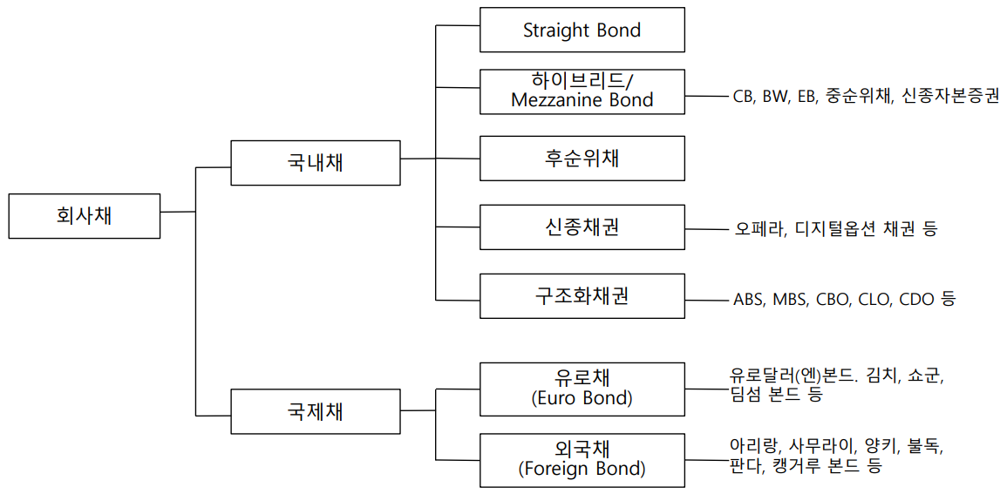

- 주가연동 옵션부채권(CB, BW, EB)의 차이점과 특징을 설명하시오. 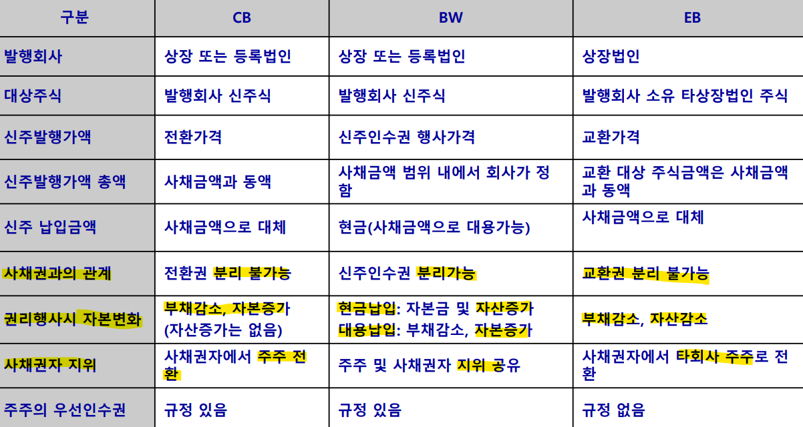
	- 전환사채의 희석효과
		- 전환권 행사 시 신주 발행으로 인한 희석효과를 고려하여
		- 전환권 가치 < 일반 스탁옵션 가치

 - Refixing
	 - 전환권 or 신주인수권의 행사가격을 주가하락 시 재조정하는 조항
	 - 희석효과 심해져서 기존 주주와 이해 충돌 우려

- 신종자본증권(영구채)의 자본 vs 부채 논쟁의 주요 이슈는 무엇인가?
	- IFRS 도입 후 일반 기업들도 주식 전환 or 원금상환과 이자지급 의무 감면 조건의 사채(조건부자본증권)을 발행할 수 있게됨
	- 실질은 회사채와 별반 차이가 없는데 자본으로 인정받는다.
	- 형식만 영구채. 실질은 만기 5년 회사채 (콜옵션을 갖고 있어서)

- 조건부자본증권(코코본드)의 발행동기와 의의를 설명하시오.
	- Contingent Convertible Bond
	- 바젤III부터 신종자본증권 & 후순위채는 조건부자본 요건을 충족하는 중도상환 가능성이없는 영구채 형태로 발행되어야 자기자본으로 인정
	- 자본성 강

- 변동금리채와 역변동금리채의 이자율위험을 비교하시오.
	- 변동금리채(FRN)
		- 지급이자 = 기준금리<변동>(reference reate) + 발행 가산금리<고정>(spread)
		- 매 이자지급기간마다 단기채를 계속 발행하는 효과
			- 발행자는 단기금리로 장기자금을 조달하는 효과
			- 투자자는 낮은 금리위험이라는 이점
	- 역변동금리채(Inverse FRN)
		- 액면이자 = 고정금리 - 기준금리<변동>
		- 금리변동에 대한 손익변동폭이 가장 큰 공격적인 채
	- 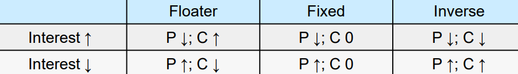

- 자산유동화증권의 특징과 장점을 설명하시오.
	- ABS: Asset-Backed Securities
	- 유동화회사(SPC)가 유동화자산을 양수하여 집합하고(pooling) 이를 기초로 ABS 발행
	- 유동화자산에서 발생한 현금흐름으로 ABS의 원리금(배당금) 지급
	- 목적
		- 자금조달, 재무구조 개선, 차익거래, 위험이전 

- ELS 등 구조화증권의 특징과 이슈에 대하여 설명하시오.
	- 기초자산에 대한 옵션과 채권이 결합된 형태
	- 투자자는 발행 시점에 액면금액 납입 -> 이 금액은 만기에 액면원금을 지급하는 할인채에 일부 투자됨, 나머지는 옵션투자와 발행사 수수료 지급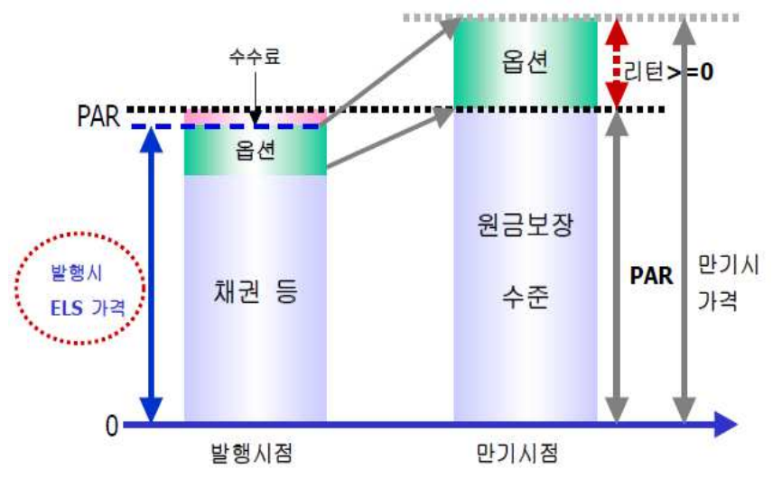
	- 이슈
		- ELS 헤지거래와 주가조작: Dynamic Delta Hedging
			- Delta = 기초자산의 변화에 대한 옵션가격의 변화분분

# 7-3. 이자율위험: 듀레이션과 컨벡서티

- 이자율위험의 측정수단으로서 듀레이션을 설명하시오.(Macaulay Duration vs. modified duration)
	- Macaulay Duration: 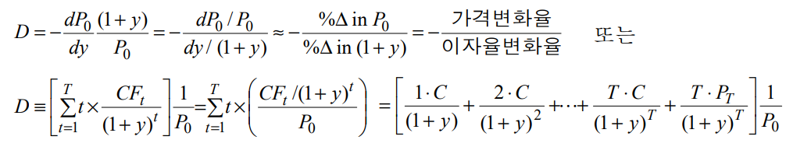
	- Modifided duration 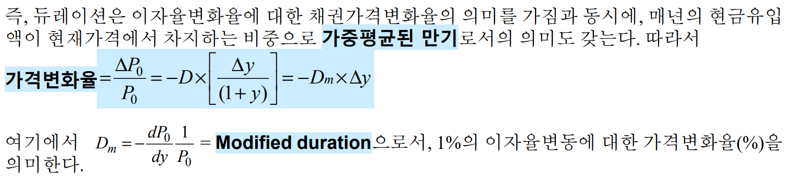
	- 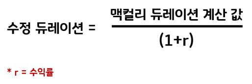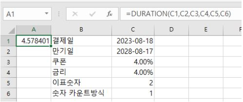

- 이자율위험의 두가지 성분에 대하여 설명하시오.
	- 재투자위험 노출: 듀레이션 < 목표투자기간
	- 가격위험 노출: 듀레이션 > 목표투자기간

- 면역전략은 무엇이며, 한계점은 무엇인가?
	- 면역전략: 채권의 듀레이션과 목표투자기간을 일치시키면, 이자율 위험의 두 성분인 가격위험과 재투자위험이 상쇄되어 이자율 변동위험에 면역됨(immunized)
	- 한계
		- flat(수평) yield curve를 가정
		- 금리변동 시 수익률곡선의 수평적 이동(parallel shift)를 가정
		- 채권의 지급불능위험 및 중도 수의상환위험이 없다고 가정
		- 인프레가 고려되지 않음
		- 계속적인 rebalancing으로 인한 거래비용의 과다다

- 동일한 듀레이션을 갖는 두 채권이 컨벡서티가 서로 다르다면, 어떤 것을 선택할 것인가?
	- 

# 7-4. 수익률곡선과 금리파생상품

- Yield curve
	- 이자율 기간구조(term structure of interest rates)를 보여줌
	- 다른 조건은 모두 같되 만기만 서로 다른 채권들 간 YTM을 도표
	- 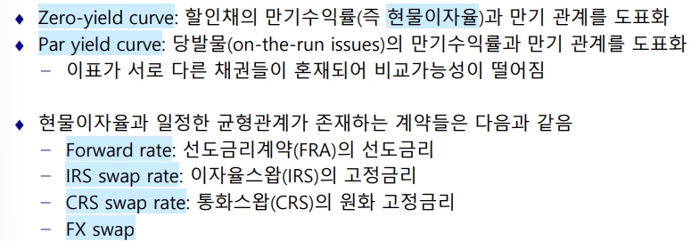

- 현물이자율과 선도이자율간의 균형관계를 설명하시오.
	- 두 전략의 수익률이 같아야 무차익조건을 만족하는 균형상태가 됨
	- 2년 만기 채권을 만기 보유 = 1년 만기 채권을 1년씩 보유하면서 갈아타기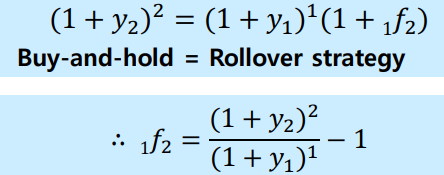
		- $y_1, y_2$: 만기 1년, 2년의 무이표채 만기수익률(spot interest rate)
		- $_1 f_2$: 미래 1년 초부터 2년 말까지 적용될 이론 선도이자율 or 내재 선도이자율
		
	

- 우상향 수익률곡선 상황에서 선도이자율과 이자율스왑의 스왑레이트는 현물이자율과 어떠한 관계를 갖는가? 
	- 우상향 yield curve에서 $y_2< \ _1f_2$
	- $y_2 = \sqrt{(1+y_1)(1+ \ _1f_2)}-1$ (기하평균)

- 이자율 스왑 Interest Rate Swap
	- swap rate(고정금리 부분)는 계약체결 시점의 거래 당사자 양측에게 공정하도록 IRS Pay(고정금리 지급, 변동금리 수취)의 가치가 0이 되도록 결정됨. 즉 고정금리 지급의 가치와 변동금리 수취의 가치 가 동일하도록 결정됨
	- $V_{\text{IRS Pay}} = V_{floating}-V_{fixed}=0$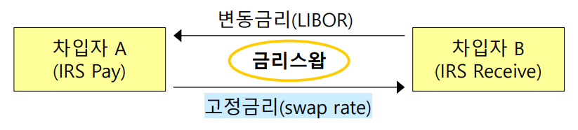
- CRS: Currency Rate Swap
	- 이종통화 간 원금과 이자를 교환
	- 만기까지 정기적인 이자금액의 교환이 일어나는 것은 금리스왑과 유사
	- 이종 통화 원금이 통화스왑 개시 및 만기 시점에 교환된다는 것은 금리스왑과 차
	- $V_{\text{CRS Pay}} = S \cdot B_F = B_D$
		- $S$: 현물환율
		- $B_F$: 만기까지 정기적인 달러 수취의 가치
		- $B_D$: 원화 지급의 가치
	- 만기까지 정기적으로 달러 변동금리를 수취 &원화 고정금리(CRS Rate)를 지급. = 만기에 원금을 교환하는 선도거래의 연속

- P&G와 BTC 간에 체결한 이자율스왑 계약의 위험을 양 당사자 입장에서 각각 평가해보시오.
	- P&G는 5년간 30-day CP average보다 75bp 낮은 변동금리를 지급하는 셈이 됨. 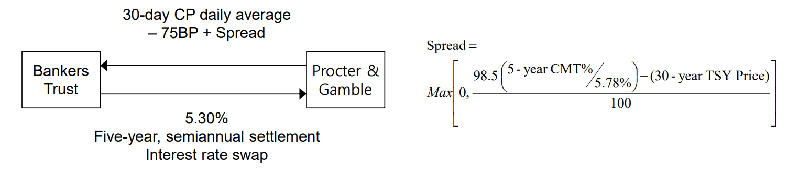
	- 그러나 1994년 2월부터 급격한 금리상승으로 인해 막대한 손실에 직면한 P&G는 BTC를 상대로 소송제기 (금리상승 위험에 노출)
		- 파생금융상품에 내재되어 있는 위험 등을 정확하게 설명해 주지 않았으며, 이 스왑거래가 옵션이 내재되어 있다는 사실을 숨긴 채로 불리한 조건이었음을 주장
	- 미국법원에서는 옵션계약의 대상이 되는 명확한 기초상품이 이 계약에 명시되어 있지 않아 옵션계약으로 볼 수 없다고 판정 
		- 또한, 파생상품의 거래에서 거래 상대방의 손익을 충분히 고려하여 상품에 대한 자세한 설명을 할 의무가 있는가라는 점에 대해선 미결말