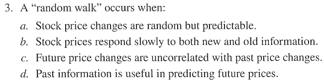
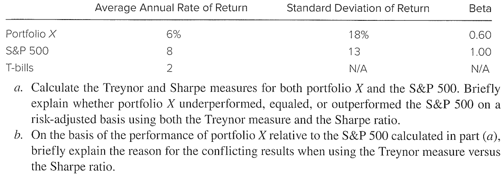

# Ch 11) Efficient Market Hypothesis

### 11)  
The answer is a. 
Weak form EMH asserts that stock prices already reflect market trading data. It implies that trend analysis is fruitless

### 15)
Yes.
Private information triggers the price rising. It's impossible in EMH.

### 25)
1. Do event studies on past announcement. If security prices reflect all currently available information, then price changes must reflect new information. Therefore, it seems that one should be able to measure the importance of an event of interest by examining price changes during the peroid in which the event occurs.
2. Determine abnormal return from market model including industry.
	1. $R_{Ford}= \alpha + \beta_M R_M+ \beta_{IND} R_{IND} + e$
	2. $e = R_{Ford} - (\alpha + \beta_M R_M +\beta_{IND} R_{IND})$
### 26)
Yes.
Investor was dissapointed that increased annual earning is lower than expectation.
### 27)
Thinly traded stock has a scarce market trading data. CAPM explains market risk premiums. Thus, positive CAPM alpha implies the higher alphas in market risk and does not violates market efficiency.

### 28)
Insider sells before the bad news.
Insider purchases after the bad news with expectation of good news. 

### 29)

(a) No. Timing to determine the cycle phase is difficult to everyone. Changing risk premiums is not related to market efficiency

(b) Stock price decreases in recession, becuase risk tolerance might be lower and investors could sell many stocks. In contrast, stock price increases in booming, because risk tolerance might be higher and investors could buy many stocks.  This price impact occurs in short period which means 'overreact.'

### CFA 3)
The answer is c.
Random walk implies unpredictable change on stock price.

### CFA 7)

(a)
Growth stocks' growth rates can be easily overestimated by investors. 
By representativeness heuristic, investors tend to overweight recent events. It cause inevitable slowdown in future.
- Growth stock: revert to lower mean returns
- Value stocks: revert to higher mean returns

(b) 
Current stock price has to reflect all information in efficiency.
In this situation, growth stocks and value stocks provide the same risk-adjusted expected return

# CH 12) Behavioral Finance

Bias in Information Processing
- Forecasting Errors: much weight to recent experience
- Overconfidence: overestimate the precision of their beliefs or forecasts
- Conservatism: too slow in updating their beliefs in response to new evidence -> momentum
- Sample size neglect and Representativeness: do not take into account the size of a sample, acting as if a small sample is just as representative of a population as a large one.

### 3)
Overconfidence.
Investors overestimate the precision of their beliefs or forecasts and they tend to overestimate their abilities.

### 5)
New information will be adjusted to price quickly in efficient market. Therefore only indexing is the best well-adjusted price compared to the other.
Mispricing from bias in information processing cause lower returns in behavioral finance. Therefore indexing is the best because bias in information processing cannot exist in indexing.

### 9)

a -> iv
b -> iii
c -> v
d -> i
e -> ii

### 12)
Because irractional investors makes mispricing continuously. Therefore we need efficient allocation to hedge the risk of irrational investors.

# CH 18) Equity Valuation Models

### 8)

(a)
- $k=\cfrac{D_1}{P_0}+g$  
- $0.16 = \cfrac{2}{50}+g$
- $g=0.12$

(b)
- $P_0 = \cfrac{D_1}{k-g}$
- $\cfrac{2}{0.16-0.05}=18.1818$
- $D_1 = D_0 \times (1+g)$
- $D_0 = \cfrac{2}{1.12}=1.7857$
- $P_0=\cfrac{D_0 \times (1+g)}{k-g}=\cfrac{1.7857 \times 1.05}{0.16-0.05}=17.0453$

(c)
pessimistic forecast -> price falls & earning maintains -> PER falls

### 10)

(a)
+) plowback ratio (retention ratio): 재투자율
- $k = R_f + \beta[E(R_m)-R_f] = 0.06 + 1.25(0.14-0.06) = 0.16$
- $g=\frac{2}{3}0.09=0.06$
- $D_1 = E_0 (1+g)(1-b) = 3(1+0.06)(1-\frac{2}{3})=1.06$
- $P_0=\cfrac{D_1}{k-g}=\cfrac{1.06}{0.16-0.06}=10.6$

(b)
- $\cfrac{P_0}{E_0}= \cfrac{10.6}{3}=3.5333$
- $\cfrac{P_0}{E_1}= \cfrac{10.6}{E_0(1+g)}=3.3333$

(c)
- $P_0-\cfrac{E_1}{k}=10.6-\cfrac{3.18}{0.16}=-9.275$

(d)
- $g = \frac{1}{3}0.09=0.03$
- $D_1 = E_0 (1+g)(1-b) = 3(1+0.03)(1-\frac{1}{3})=2.06$
- $V_0=\cfrac{D_1}{k-g}=\cfrac{2.06}{0.16-0.03}=10.6=15.8462$

(e)
- The firm reduces investment to a lower ROE project by reducing its plowback ratio.
- $V_0>P_0$: $(15.8462>10.6)$ 

### 17)

5 years
EPS 10 -> reinvested
ROE 20% = growth
year 6 ROE 15%
dividend 40% reinvest 60%
capitalization rate 15%

(a)
- $g_6=0.15(1-0.4)=0.09$
- $E_6 =10(1+0.2)^5(1+0.09) =27.12269$
- $D_6=E_6(1-0.4)=(27.12269)(0.6) = 10.84908$
- $V_5=\cfrac{D_6}{k-g}=\cfrac{10.84908}{0.15-0.15(1-0.4)}=180.8179$
- $V_0=\cfrac{V_5}{(1+k)^5}=\cfrac{180.8179}{1.15^5}=89.89846$

(b)
The price will rise upto 15% per year until year 6 because total earning goes reinvestment.
- $P_1 = V_0(1+0.15)=103.3832$

(c)
- $P_2 = P_1(1+0.15)=118.8907$

(d)
- $g_6=0.15(1-0.2)=0.12$
- $E_6 =10(1+0.2)^5(1+0.12) =27.86918$
- $D_6=E_6(1-0.2)=(27.86918)(0.8) = 5.573837$
- $V_5=\cfrac{D_6}{k-g}=\cfrac{5.573837}{0.15-0.15(1-0.2)}=185.7946$
- $V_0=\cfrac{V_5}{(1+k)^5}=\cfrac{185.7946}{1.15^5}=92.37273$

### 23)

(a)
- $k=0.15$: required return
- $g=ROE \times b = 0.2 \times 0.5 = 0.1$
- $D_0=1 \times 0.5=0.5$
- $P_0= \cfrac{D_0(1+g)}{k-g} = \cfrac{0.5\times1.1}{0.15-0.1}=11$

(b)

| EPS    | Dividend | ROE  | Payout | Growth Rate |
| ------ | -------- | ---- | ------ | ----------- |
| 1      | 0.5      |      |        |             |
| 1.1    | 0.55     | 0.2  | 0.5    | 0.1         |
| 1.21   | 0.726    | 0.2  | 0.4    | 0.1         |
| 1.2826 | 0.76956  | 0.15 | 0.6    | 0.06        |
- EPS = EPS_past * (1 + growth rate)
- Dividend = EPS * (1 - Payout)
- $P_2 = \cfrac{D_3}{k-g}=8.551$
- $V_0 = \cfrac{0.55}{1.15} + \cfrac{0.726+8.551}{1.15^2}=7.49$

(c)
- $g=ROE \times b = 0.2(1-0.5)=0.1$
- $P_1=P_0(1+g) = 11(1+0.1)=12.1$
- $R_1 = \cfrac{(P_1-P_0)+D_1}{P_0}=0.15$

(d) 
- $R_2 = \cfrac{(P_2-P_1)+D_2}{P_1}=\cfrac{(8.551-12.1)+0.726}{12.1}=-0.233$

(e) 
- $P_3=P_2(1+0.06)=9.064$
- $R_3 = \cfrac{(P_3-P_2)+D_3}{P_2}=\cfrac{(9.064-8.551)+0.7696}{8.551}=0.150$

### CFA 1)

(a)
- $P=\cfrac{D}{k-g}$
Price will rise/fall if dividends is rised/fallen.
Growth rate will rise/fall if dividend payout ratio is fallen/rised.
Price will rise/fall if growth rate is rised/fallen.
Higher dividend is not clear estimator of stock price.

(b)
- i) Sustainable growth rate will rise/fall if dividend payout ratio is fallen/rised. Lower sustainable growth rate causes lower dividend payout ratio. 
- ii) Growth rate of book value will rise/fall if dividend payout ratio is fallen/rised. Lower  growth rate of book value causes lower dividend payout ratio. 

### CFA 8)

(a)
- Required Return's proxy is the expected market return
- $k=R_f+\beta(R_M-R_f)=0.045+1.15(0.145-0.045)=0.16$

(b)
- $D_4=1.72(1+0.12)^3(1+0.09)=2.633959$
- $P_3=\cfrac{D_4}{k-g}=\cfrac{2.633959}{0.16-0.09}=37.62799$
- Pressent Value of stock price at first = $\cfrac{P_3}{(1+k)^3}=24.10666$
- Present Value of dividends

|                        | Dividend |       |                | PV of dividend |
| ---------------------- | -------- | ----- | -------------- | -------------- |
| 1.72(1+0.12)^1         | 1.9264   |       | x_1/(1+0.16)^1 | 1.66069        |
| 1.72(1+0.12)^2         | 2.157568 |       | x_2/(1+0.16)^2 | 1.603424       |
| 1.72(1+0.12)^3         | 2.416476 |       | x_3/(1+0.16)^3 | 1.548134       |
| 1.72(1+0.12)^3(1+0.09) | 2.633959 | $D_4$ |                |                |
|                        |          |       | Total          | 4.812248       |

- Intrinsic value of stock: $4.812248 + 24.10666=28.91891$

# CH 14) Bond Prices and Yields

- purchase bond == cash outflow
- receipt coupon payment and face value == cash inflows

- $n$: the number of time periods ($n=20$ of 10 years)
- $i$: the interest rate per period
	- If the interest rate is 6%, you would enter 6, not 0.06.
- $PV$: present value
- $FV$: future value of face value of the bond (=one-time future payment of a cahs flow)
- $PMT$: the amount of any recurring payment
	- for zero-coupon bonds, $PMT$ will be zero

- Bond Indentures
	- = contract(restriction) between the issuer and the bond holder
	- Sinking fund
		- firm can repurchase only a limited fraction of the bond issue at the sinking fund call price
	- Collateral
		- Mortgage bond: If the collateral is property
		- Collateral trust bond: If the collateral takes the form of other securities held by the firm
		- Debenture bonds: unsecured, meaning they do not provide for specific collateral
	

### 25) 
- Issue size: ABC has larger debt than XYZ 
- Maturity: ABC has shorter maturity than XYZ
- Collateral: ABC is secure than XYZ due to its real property for default.
- Callable: ABC is not callable that makes investors relieve
- Sinking fund: ABC is not sinking fund that makes investors relieve

### CFA 3) 

(a)
- Let coupons are paid at every 6 month.
- coupon rate of each payment after market interest rate declines 1%: $(4-1)/2=1.5$% 
- 108.5843 = PV(rate=0.015, nper=20, PMT=-2, FV=-100)
- Price of Colina bond will increase, but to the call price 102.

(b)
When the rates are expected to rise, Colina is better due to higher coupon.
When the rates are expected to fall, Sentinal is better due to no call

### CFA 4)
Market Conversion value = Conversion Ratio X Market price of underlying common stock
- $20.83 \times 28 = 583.24$
Conversion Premium = Market price of bond - Market conversion value
- $77.5 - 583.24=-505.74$ (weird...)
### CFA 5)

(a)
To compensate the investor's risk of calling back, The firm should decide a higher coupon with call feature. Therefore, offering yield is high with call feature.

(b) 
After executing call feature, expected life of bond becomes shorter than maturity.

(c) Callable bond's
- Advantage: higher coupon
- Disadvantage: risk of calling (short maturity)

### CFA 6)

(a) iii

(b) iii

(c) iii: discount when coupon rate < YTM

(d) ii: lower price when YTM < coupon rate

# CH 15) Term Structure of Interest Rates

### 7)  

$P_0 = \cfrac{PAR}{(1+YTM)^t}$

Let the face value of the bond $1000 for simplicity

| Face value | Year | Price  | YTM(a)  | YTM Formula         | Forward Rate (b) | Forward Rate Formula      |
| ---------- | ---- | ------ | ------- | ------------------- | ---------------- | ------------------------- |
| 1000       | 1    | 943.40 | 0.06    | (A62/C62)^(1/B62)-1 |                  |                           |
| 1000       | 2    | 898.47 | 0.05499 | (A63/C63)^(1/B63)-1 | 0.050007         | (1+D63)^B63/(1+D62)^B62-1 |
| 1000       | 3    | 847.62 | 0.05665 | (A64/C64)^(1/B64)-1 | 0.059992         | (1+D64)^B64/(1+D63)^B63-1 |
| 1000       | 4    | 792.16 | 0.05998 | (A65/C65)^(1/B65)-1 | 0.070011         | (1+D65)^B65/(1+D64)^B64-1 |

### 8)

| Year | Sum of Forward Rate |                         | Expected Price (a) |          | Expected Rate of Return (b) |            |
| ---- | ------------------- | ----------------------- | ------------------ | -------- | --------------------------- | ---------- |
| 1    |                     |                         | 792.16             | C65      | 0.059996                    | D69/D68-1  |
| 2    | 1.1909              | (1+F63)x(1+F64)x(1+F65) | 839.6862           | 1000/B69 | 0.050007                    | D70/D69-1  |
| 3    | 1.1342              | (1+F64)x(1+F65)         | 881.6766           | 1000/B70 | 0.059992                    | D71/D70-1  |
| 4    | 1.0700              | (1+F65)                 | 934.5697           | 1000/B71 | 0.070011                    | 1000/D71-1 |

### 11) 

(a)
- $P=\cfrac{9}{1+0.07}+\cfrac{100(1+0.09)}{(1+0.08)^2}=101.8611$
(b)
- $\cfrac{9}{1+r}+\cfrac{100(1+0.09)}{(1+r)^2}=101.8611$
- $r=7.95758$ by `=RATE(2, 9, -101.86, 100)` in excel

(c)
- $f_2=\cfrac{(1+0.08)^2}{1+0.07}-1=0.09009$
- $P=\cfrac{100(1+0.09)}{1+f_2}=99.9914$

(d)
- $f_2 - \text{Liquidity Premium}=0.08009$
- $P=\cfrac{100(1+0.09)}{1+0.08009}=100.91719$

### 13)

+) Annuity Factor: $=\cfrac{1-(1+y)^{-t}}{y}$
+) PV Factor: $= \cfrac{1}{(1+y)^t}$

| year | forward rate | PV of 1 dolloar | formula                     |
| ---- | ------------ | --------------- | --------------------------- |
| 1    | 0.05         | 0.9524          | 1/(1+B55)                   |
| 2    | 0.07         | 0.8901          | 1/((1+B55)*(1+B56))         |
| 3    | 0.08         | 0.8241          | 1/((1+B55)*(1+B56)*(1+B57)) |

(a)
- $60 \times 0.9524 + 60 \times 0.8901 + (1000+60) \times 0.8241 =984.1402$

(b) 
- 7% from $RATE(3, 60, -984.1402, 1000)$ in excel

(c)

| Year |      |             | Future Value  |
| ---- | ---- | ----------- | ------------- |
| 1    | 60   | 1.07 x 1.08 | 69.336        |
| 2    | 60   | 1.08        | 64.8          |
| 3    | 1060 |             | 1060          |
|      |      |             | SUM: 1194.136 |

- $984.1402 (1+y)^3 = 1194.136$
- $y=0.06659$

(d)

- $60 * \cfrac{1-(1 + 0.07)^{-2}}{0.07} + 1000 * \cfrac{1}{ (1 + 0.07)^2}=981.92$
- $981.92-984.14=-2.22$

### CFA 1)

Yield curve reflects investor ==expectations== about future interest rates. 
According to this theory, long-term interest rates are an average of current and expected future short-term interest rates. (1) If investors expect future s**hort-term rates to be higher than current short rates**, the yield curve will slope **upwards**. Conversely, (2) if they expect future short-term rates to fall, the yield curve will slope downwards.

The ==liquidity preference hypothesis== suggests that investors demand a premium for holding longer-term bonds rather than rolling over short-term bonds.
As a result, (1) **long-term interest rates** will typically be **higher than short-term** rates to compensate for this additional risk, resulting in an **upward**-sloping yield curve. In contrast, (2) A **downward** slope under this hypothesis would indicate a strong expectation of **falling future interest rates than current short rate,** overshadowing the usual liquidity premium

# CH 16) Managing Bond Portfoilo

### 12)

(a)
-  $10000 * \cfrac{1-(1 + 0.08)^{-2}}{0.08}=17832.64746$ is present value of the obligation
- $10000 * \cfrac{1}{ (1 + 0.08)^1}=9259.259259$ 
	- weight: $9259.259259/17832.64746=0.5192$
- $10000 * \cfrac{1}{ (1 + 0.08)^2}=8573.388203$
	- weight: $8573.388203/17832.64746=0.4807$
- $1*0.5192+2*0.4807=1.4808$ years is the duration of the obligation

(b)
- $17832.64746*(1+0.08)^{1.4808}=19985.20892$

(c)
- $\cfrac{19985.20892}{(1+0.09)^{1.4808}}=17590.9254$
- $10000 * \cfrac{1-(1 + 0.09)^{-2}}{0.09}=17591.11186$
- Net position decrease to $17591.11186-17590.9253=0.1864$

(d)
- $\cfrac{19985.20892}{(1+0.07)^{1.4808}}=18079.98637$
-  $10000 * \cfrac{1-(1 + 0.07)^{-2}}{0.07}=18080.18168$
- Net position decrease to $18080.18168-18079.98637=0.1953$

### 14)

(a)
- $\cfrac{1+0.05}{0.05} = 21$ years
- $w \times 5 + (1-w) \times 21$
	- $w=0.6875$ invested in zero-coupon bond
- $1-0.6875$ invested in the perpetuity

(b)
- $w \times 4 + (1-w) \times 21$
	- $w = 0.7059$
	- invest 0.7059 in zero-coupon bond and 1-0.7059 in perpetuity

### 23) 

- Let par value as 1000 for simplicity.
	- Zero Coupon Bond Price $P=\cfrac{F}{(1+r)^n}$
	- Coupon Bond Price $P=C\times \cfrac{1-(1+r)^{-n}}{r} + \cfrac{F}{(1+r)^n}$
		- $C = F \times coupon$
- YTM 8%
	- Price of zero coupon bond: 374.84 
		- =1000/(1+0.08)^12.75 
	- Price of coupon bond:  774.84
		- =0.06*(1-(1+0.08)^(-30))/0.08 + 1000/((1+0.08)^30)
- YTM 9%
	- Price of zero coupon bond: 333.28 
	- Price of coupon bond:  691.79
- YTM 7%
	- Price of zero coupon bond: 422.04
	- Price of coupon bond:  875.91

(a) 
- Acutal percentage capital loss
	- Zero coupon bond: $\cfrac{333.28-374.84}{374.84}=-0.1109$,  loss 11.09%
	- Coupon bond: $\cfrac{691.79-774.84}{774.84}=-0.1072$, loss 10.72%
- By the duration-with-convexity rule
	- Zero coupon bond: $(-11.81\times 0.01)+(\frac{1}{2}\times150.3\times0.01^2)=-0.1106$
		- loss 11.06%
	- Coupon bond:  $(-11.79\times 0.01)+(\frac{1}{2}\times231.2\times0.01^2)=-0.1063$
		- loss 10.63%

(b)
- Acutal percentage capital loss
	- Zero coupon bond: $\cfrac{422.04-374.84}{374.84}=0.1259$,  Gain 12.59%
	- Coupon bond: $\cfrac{875.91-774.84}{774.84}=0.1304$, Gain 13.04%
- By the duration-with-convexity rule
	- Zero coupon bond: $(-11.81\times (-0.01))+(\frac{1}{2}\times150.3\times0.01^2)=0.1256$
		- Gain 12.56%
	- Coupon bond:  $(-11.79\times (-0.01))+(\frac{1}{2}\times231.2\times0.01^2)=0.1295$
		- Gain 12.95%

(c)
- The coupon bond outperforms zero coupon bond due to its higher convexity. It's not related to the change of rate.

(d)
- No one wants to buy lower convexity bond if it underperforms.
	- Lower convexity -> price fall -> YTM increase (higher yield)
- If rates change slightly, higher yield & lower convexity bond will be preferred. But changing large amount, lower yield & higher convexity bond will be preferred.

### CFA 3) 

(a) $\cfrac{10}{1.08}=9.2593$ years

(b) Because modified version considers not only final cash flow, but also changes in interest rates

(c)
i. Modified duration will increase due to decreasing coupon rates
ii. Modified duration will decrease due to decreasing maturity duration

(d)
- $\cfrac{\Delta P}{P} = (-D^* \times \Delta y) + \frac{1}{2} \times Convexity \times (\Delta y)^2$

# CH 24) Portfolio Performance Evaluation

### 9)

(a)
- Alpha = Intercept of regression
	- Stock A: 1%
	- Stock B: 2%
- Information Ratio = $\cfrac{\alpha}{\sigma(e)}$
	- Stock A: 0.0971
	- Stock B: 0.1047
- Excess Return of each stock = $r_i -r_f$
	- Stock A: $0.01 + 1.2(0.14-0.06) = 0.106$
	- Stock B:  $0.02 + 0.8(0.14-0.06) = 0.084$
- Sharpe Ratio = $\cfrac{r_i-r_f}{\sigma}$
	- Stock A: $\cfrac{0.106}{0.216}=0.4907$
	- Stock B: $\cfrac{0.66}{0.249}=0.3373$
- Treynor measure = $\cfrac{r_i-r_f}{\beta}$
	- Stock A: = 0.0883
	- Stock B: = 0.105

(b)

i. Stock A due to higher sharpe ratio
ii. Stock B for hedge to market portfolio
iii. Stock B due to higher treynor measure

### 10)

|     | Selection |               | Timing |           |
| --- | --------- | ------------- | ------ | --------- |
| A   | Bad       | intercept < 0 | Good   | steeper   |
| B   | Good      | intercept > 0 | Good   | steeper   |
| C   | Good      | intercept > 0 | Bad    | declining |
| D   | Bad       | intercept < 0 | Bad    | declining |
- Intercept means excess return. 
- Negative excess return means poor selection.

### 11)

(a)
- Benchmark: $0.6 * 0.025+ 0.3*0.012 +0.1*0.005=0.0191$
- Actual: $0.7*0.02+0.2*0.01+0.1*0.005=0.0165$
- Underperformance: 0.0026

(b)

| Asset  | Ri-Rm  | * Acutal Weigth | = Contribution |
| ------ | ------ | --------------- | -------------- |
| Equity | -0.005 | 0.7             | -0.0035        |
| Bonds  | -0.002 | 0.2             | -0.04          |
| Cash   | 0      | 0.1             | 0              |
- Contribution of security selection: -0.39%

(c)

| Asset  | Wi-Wm | * Index Return | = Contribution |
| ------ | ----- | -------------- | -------------- |
| Equity | 0.1   | 0.025          | 0.025          |
| Bonds  | -0.1  | 0.012          | -0.0012        |
| Cash   | 0     | 0.005          | 0              |
- Contribution of asset allocation: 0.13%

(d)
- $-0.39\% + 0.13\% = -0.26\%$

### CFA 4)

- $\cfrac{0.11-0.08}{1.1}=0.0273$
### CFA 5)

- $\cfrac{0.24-0.08}{0.18}=0.8889$

### CFA 6)

(a)
- Treynor: 
	- S&P 500: $\cfrac{0.08-0.02}{1}=0.06$
	- X: $\cfrac{0.06-0.02}{0.6}=0.0667$
- Sharpe:
	- S&P 500: $\cfrac{0.08-0.02}{0.13}=0.4615$
	- X: $\cfrac{0.06-0.02}{0.18}=0.2222$
- X outperforms market on Treynor measure, but underperforms on Sharpe measure.

(b)
- X has lower beta than market. It means lower systematic risk.
- But X has higher standard deviation of return. It means higher unsystematic risk. (volatility)
- Thus, X outperforms market on Treynor measure, but underperforms on Sharpe measure.