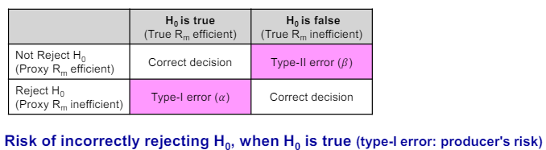

# 4-1. CAPM

  

- 포트폴리오 이론
	- How an investor could select an optimum portfolio
	- CAPM
		- How prices will be set so that markets clear in equilibrium
	- Two fund separation theorem (Mutual fund theorem)
		- Any portfolio on a line connecting risk-free assets and tangent portfolio

---
  
- CAPM의 주요 가정
	1. Investors are rational mean-variance optimizers
	2. 모든 투자자는 같은 기대를 가지기에 같은 선택을 함
	3. 개인투자자는 무위험수익률로 borrowing lending 가능
	4. 단일 기간 투자
	5. Partial equilibrium: 자본 시장 내에서만 균형을 이룸
	6. Perfect capital markets
		- Information is costless & available to all
		- No taxes, No transaction costs

---
  
- CML: 시장이 균형 상태에 놓였을 때 CAL들 중 최대 sharpe ratio 가지는 것
	- 그러므로 CML 상의 시장 포트폴리오는 mean-variance efficient 하다 

---
  

- 시장 균형 하에서 접점 포트폴리오가 시장 포트폴리오가 되는 이유
	- 모든 투자자들이 risky asset으로 이루어진 자신들만의 tangent portfolio를 가제 되고 Market portfoilo는 그것들이 집합체가 되기 때문이다. 그래서 Market portfolio는 value weighted로 구성된다.
	- 참고로 risk-free asset은 zero net supply이기에 가격변동이 없다.
	- Market clearing condition requires that demand = supply

---

- SML
	- 합리적 투자자라면 총위험이 아닌 체계적 위험만 보상받으면 된다. 비체계적 위험은 분산효과로 쉽게 제거할 수 있으니깐.
	- 그러므로 균형에서, 초과수익 대 베타 비율이 모든 주식에서 동일해야 한다.

  
- SCL
	- If CAPM is true, then $H_0: (\alpha_i=0, \beta_i \neq 0)$
---
  
- Roll's Critique의 핵심 내용
	- Is CAPM testable?
	- CAPM 테스트를 위해서는 market proxy가 tangent portfolio여야 한다. 그러나 현실에서 market portfoilo가 수없이 많기에 완벽한 시장 포트폴리오를 구할 수 없다. 그러므로 CAPM은 검증 불가능하다.
	- (Market portolio in the CAPM is unobservable, and proxied by a market index)
	- CAPM은 가기 전부터 선형관계는 어디서든 성립했다. 선형관계를 test하는 것은 의미가 없다. CAPM 핵심은 사용한 포트폴리오가 market efficient portfolio가 되는가 이다. 사용한 market portfolio가 진짜 tangent인지 test해야 한다.
	

---

- GRS test는 무엇을 검증하는가? 왜 유용하게 사용되는가?
	- (Duality of CAPM test with MV efficiency test)
	- 검증 대상
		- market portfolio처럼 팩터 포트폴리오들의 선형 결합들이 efficient frontier portfolio이거나 그렇게 되는지
		- market model의 초과수익에 대한 시계열 회귀의 "절편"이 모든 자산에 대하여 0인지 확인한다
	- 유용성
		- 기존의 factor portfolio에 새로운 factor를 추가한 후의 maximum sharpe ratio가 기존보다 커지는지 확인하고, 그렇다면 기존 방식을 기각하고 새로운 포트폴리오를 택함으로서 팩터 포트폴리오를 개선할 수 있기 때문에 유용하다.

  
---
- CAPM 검증에 있어 결합가설의 문제란?
  - CAPM에서 사용한 market portfolio가 진정으로 시장을 대변할 수 있어야만 CAPM test도 정확하다고 말할 수 있다.

  

- Extension of CAPM
  1.  Merton's Intertemporal CAPM: 미래의 상태 변수 변화에 따라 wealth가 어떻게 변할 지
      - State variable: 거시 경제 요인과 같이 미래 투자 기회에 영향을 줄 수 있는 변수. (임금, 소비재 가격, 포토플리오 기회)
  2.  Breeden's Consumption CAPM
  3.  Conditional CAPM: 베타와 risk premium이 경제 환경의 변화에 따라 변한다고 가정

  

---

  

# 4-2. APT

- APT와 CAPM의 주요 차이점
	1.  APT가 CAPM보다 일반적이다. 그 이유는 다음의 가정이 없이 때문.
		1. Existence of market portfolio
		2. Mean-Variance decision
		3. Riskless borrowing or lending
	2.  CAPM은 market factor만으로 수익률을 설명하지만 APT는 여러 factor 동시에 다룰 수 있다.
---	

- one factor APT = CAPM
---

- APT의 intercept는 risk free rate

---  

- APT의 문제점
	1. 관측불가능한 마켓 포트폴리오를 사용하는 CAPM처럼 testability에 잠재적인 문제가 존재
	2. 오로지 well diversified portfolio에 적용 가능.
---

- 요인복제포트폴리오(FMP)란
	- 실증적으로 밝혀낸 주가 영향 요인들을 기반으로 long-short hedge portfolio를 구성하면, 해당 요인에 의한 변동은 최대한 반영하면서 다른 요인들에 대해서는 0의 민감도를 가지는 포트폴리오
	- $\lambda_k =$ k번째 FMP's expected excess return OR risk premium of factor k

---

- Tracking Portfolio

---

- 팩터투자란 무엇이며 왜 유용한가
	- 주식 수익률의 공통적 팩터를 찾고 이에 기반하여 포트폴리오를 구성하고 관리하는 투자 전략
	1. Diversification: 다양한 팩터들을 포트폴리오에 통합함으로써 투자 위험을 분산할 수 있다.
	2. Adaptability: 경제 및 시장 상황에 따른 각기 다른 팩터들이 보여주는 성과가 달라지기에 이에 맞춰 포트폴리오를 조정할 수 있다.
	- 

---

- 국내 팩터투자에 대한 실증결과, 의미 있는 팩터들로서 어떤 것들이 있는가?
	- 국내 팩터투자
		- 사이즈 팩터: 소형 가치주가 대형 가치주보다 우수함
		- 퀄리티 팩터: 중소형주에서 유효함
	- 의미 있는 팩터
		- size factor
		- low risk/volatility factor
		- momentum factor
		- high dividend yield factor
		- quality factor
		- value factor
		- multi factor