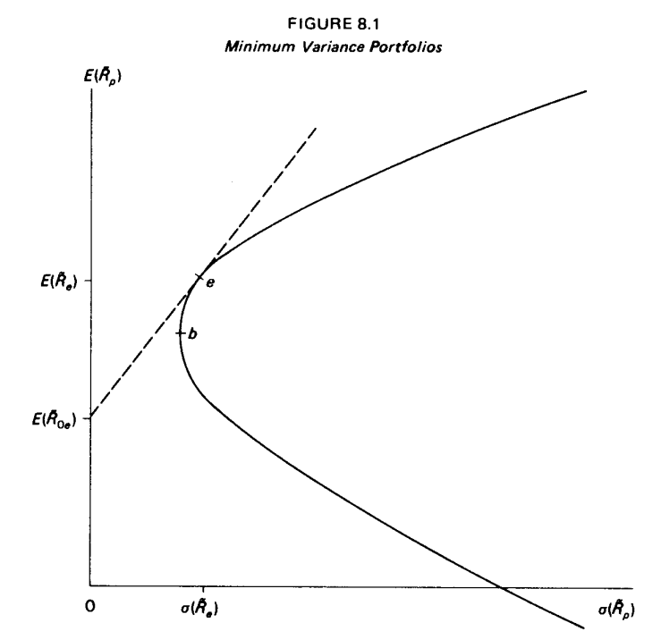

# Ex 8

두 확률 변수 X와 Y가 평균 $\mu_x$, $\mu_Y$와 분산 $\sigma_X^2$, $\sigma_Y^2$ 그리고 공분산 $\sigma_{XY}$를 가지는 bivariant normal distribution을 따른다고 할 때, X의 값이 주어진 상황에서 Y의 조건부 기댓값은 다음과 같은 선형관계를 가진다
- $E(Y|X) = \mu_Y + \cfrac{\sigma_{XY}}{\sigma^2_X}(X-\mu_X)$
$R_{it}$와 $R_{mt}$에 대해서 나타내면 다음과 같다
- $E(\tilde{R_{it}}|R_{mt}) = E(\tilde{R_{it}}) + \cfrac{Cov(\tilde{R_{it}}, \tilde{R_{mt}})}{Var(\tilde{R_{mt}})}(R_{mt}-E(\tilde{R_{mt}}))$
$R_{mt}$에 관한 선형관계로 정리하면 다음과 같다
- $E(\tilde{R_{it}}|R_{mt}) = E(\tilde{R_{it}})-E(\tilde{R_{mt}}) + \cfrac{Cov(\tilde{R_{it}}, \tilde{R_{mt}})}{Var(\tilde{R_{mt}})} R_{mt}$

그러므로 아래 관계가 성립한다
$E(\tilde{R_{it}}|R_{mt}) = \alpha_i + \beta_i R_{mt}$
- where $\alpha_i = E(\tilde{R_{it}})-E(\tilde{R_{mt}})$
- and $\beta_i = \cfrac{Cov(\tilde{R_{it}}, \tilde{R_{mt}})}{Var(R_{mt})}=\cfrac{Cov(\tilde{R_{it}}, \tilde{R_{mt}})}{\sigma^2(R_{mt})}$

----
# Ex 9

$x_{ip}$는 각 종목별 투자 비중
- $\tilde{R_p} = \Sigma^n_{i=1} x_{ip} \tilde{R}_i$
- $E(\tilde{R_p}) = \Sigma^n_{i=1} x_{ip} E(\tilde{R_i})$
- $\sigma^2(\tilde{R_p})=\Sigma^n_{i=1}x_{ip}Cov(\tilde{R_i},\tilde{R_p})=\Sigma^n_{i=1}\Sigma^n_{j=1}x_{ip}x_{jp}\sigma_{ij}$

목적식
- $\min_{x_{ip}} \sigma^2(\tilde{R_p})$ where $i=1, ..., n$
제약식
- $E(\tilde{R_e}) \ = \ \Sigma^n_{i=1} x_{ip} E(\tilde{R_i})$
- $\Sigma^n_{i=1} x_{ip} = 1.0$

점 $e$는 minimum variance portfolio
점선은 투자기회선 
- 점 e에서의 기울기 $S_e = \cfrac{dE(\tilde{R_e})}{d \sigma(\tilde{R_e})}$

---

## Ex 9-1
라그랑지
- $L = \sigma^2(\tilde{R_p})+2\lambda_e\left[ E(\tilde{R_e}) -\Sigma^n_{i=1} x_{ip} E(\tilde{R_i}) \right] + 2\phi\left[1-\Sigma^n_{i=1} x_{ip} \right]$
$x_{ip}$에 대하여 미분 시
 - $\cfrac{\partial\sigma^2(\tilde{R_p})}{\partial x_{ip}} - 2\lambda_e E(\tilde{R_i}) - 2\phi_e=0$
	- $\cfrac{\partial\sigma^2(\tilde{R_p})}{\partial x_{ip}}=2\Sigma^n_{j=1}x_{jp}\sigma_{ij}$
- $\Sigma^n_{j=1}x_{jp}\sigma_{ij} - \lambda_eE(\tilde{R_i})-\phi_e=0$
이는 $i$뿐만 아니라 $k$라는 특정 종목에서도 성립한다면
- $\Sigma^n_{j=1}x_{jp}\sigma_{kj} - \lambda_eE(\tilde{R_k})-\phi_e=0$
- 여기서 양변에 $x_{kp}$를 곱해주고 $k$에 대해 덧셈을 하면
	- $\Sigma^n_{k=1}\Sigma^n_{j=1}x_{kp}x_{jp}\sigma_{kj} - \lambda_e\Sigma^n_{k=1}x_{kp}E(\tilde{R_k}) - \Sigma^n_{k=1}x_{kp}\phi_e = 0$
	- $\sigma^2(\tilde{R_p})-\lambda_e E(\tilde{R_p}) - 1.0 * \phi_e = 0$

$\phi_e$를 기준으로 동치되는 부분끼리 정리하면
- $\sigma^2(\tilde{R_p})-\lambda_e E(\tilde{R_p})=\Sigma^n_{j=1}x_{jp}\sigma_{ij} - \lambda_eE(\tilde{R_i})$ 
- $E(\tilde{R_i}) - E(\tilde{R_p}) = \cfrac{1}{\lambda_e}\left( \Sigma^n_{j=1}x_{jp}\sigma_{ij}-\sigma^2(\tilde{R_p}) \right)$ ... 이걸 식<1>으로 보자

라그랑지 승수 $2\lambda_e$는 포트폴리오 기대수익을 약간 증가시키는 관점에서의 $\sigma^2(\tilde{R_{p}})$의 최소값의 변화율이므로 다음과 같이 나타낼 수 있다
- $2\lambda_e = \cfrac{d\sigma^2(\tilde{R_e})}{dE(\tilde{R_e})}$
이와 유사한 형태를 가진 점 e에서의 기울기 식을 다시 한 번 살펴보면

- $\cfrac{1}{S_e} = \cfrac{d \sigma(\tilde{R_e})}{dE(\tilde{R_e})}$에서 연쇄법칙(미분)을 적용하여
- $\cfrac{d \sigma(\tilde{R_e})}{dE(\tilde{R_e})} = \cfrac{d \sigma(\tilde{R_e})}{d \sigma^2(\tilde{R_e})}\cfrac{d \sigma^2(\tilde{R_e})}{dE(\tilde{R_e})}$
	- $=\cfrac{1}{2\sigma(\tilde{R_e})}\cfrac{d \sigma^2(\tilde{R_e})}{dE(\tilde{R_e})}=\cfrac{\lambda_e}{\sigma(\tilde{R_e})}$
- $\therefore \cfrac{1}{\lambda_e}=\cfrac{S_e}{\sigma(\tilde{R_e})}$

식<1>에 이 결과를 대입하면
- $E(\tilde{R_i}) - E(\tilde{R_p}) = \cfrac{S_e}{\sigma(\tilde{R_e})}\left( \Sigma^n_{j=1}x_{ip}\sigma_{ij}-\sigma^2(\tilde{R_p}) \right)$
- $E(\tilde{R_i}) - E(\tilde{R_p}) = \cfrac{S_e}{\sigma(\tilde{R_e})}\left( Cov(\tilde{R_i}, \tilde{R_p})-\sigma^2(\tilde{R_p})\right)$
- $E(\tilde{R_i}) = [E(\tilde{R_e})-S_e\sigma(\tilde{R_e})] +\cfrac{S_e}{\sigma(\tilde{R_e})}Cov(\tilde{R_i}, \tilde{R_p})$ ... 식<2>
여기서 대괄호 부분은 무위험수익률이므로
- $E(\tilde{R_i}) = E(\tilde{R_{0e}}) +\cfrac{S_e}{\sigma(\tilde{R_e})}Cov(\tilde{R_i}, \tilde{R_p})$
이를 $S_e$로 정리하면
- $S_e= \cfrac{E(\tilde{R_e})-E(\tilde{R_{0e}})}{\sigma(\tilde{R_e})}$

이를 식<2>에 대입하면
- $E(\tilde{R_i}) = E(\tilde{R_{0e}}) + \left[ E(\tilde{R_e})-E(\tilde{R_{0e}}) \right] \beta_{ie}$ ... 식<3>
	- where $\beta_{ie} = \cfrac{Cov(\tilde{R_i}, \tilde{R_p})}{\sigma^2(\tilde{R_e})}$
$i$ 종목에서 포트폴리오 $p$로 확장해서 보면
- $\beta_{pe} = \cfrac{Cov(\tilde{R_p}, \tilde{R_e})}{\sigma^2(\tilde{R_e})} = \cfrac{Cov(\Sigma^n_{i=1}x_{ip}\tilde{R_i}, \tilde{R_e})}{\sigma^2(\tilde{R_e})} = \Sigma^n_{i=1} x_{ip}\cfrac{Cov(\tilde{R_i}, \tilde{R_e})}{\sigma^2(\tilde{R_e})} = \Sigma^n_{i=1}x_{ip}\beta_{ie}$
식<3>의 양변에 대해서 $x_{ip}$를 곱하고 $i$에 대해 덧셈을 하면 
- $E(\tilde{R_p}) = E(\tilde{R_{0e}}) + \left[ E(\tilde{R_e})-E(\tilde{R_{0e}}) \right] \beta_{pe}$
	- where $\beta_{pe} = \cfrac{Cov(\tilde{R_p}, \tilde{R_p})}{\sigma^2(\tilde{R_e})}$

## Ex 9-2
The expected return on any such portfolio is $E(\tilde{R_{0e}})$
Let $i$ and $j$ be any two securities 
- $\tilde{R_p} = x\tilde{R_i}+(1-x)\tilde{R_j}$
From the answer to the preceding problem,
- $\beta_{pe} = x\beta_ie+(1-x)\beta_je$
	- where $0<x\leq1$ is lending portfolio, and $x<0$ is borrowing portfolio
It is clear that if the value of $x$ is unrestricted, it is always possible to choose $x$ so that $\beta_{pe}=0.0$
