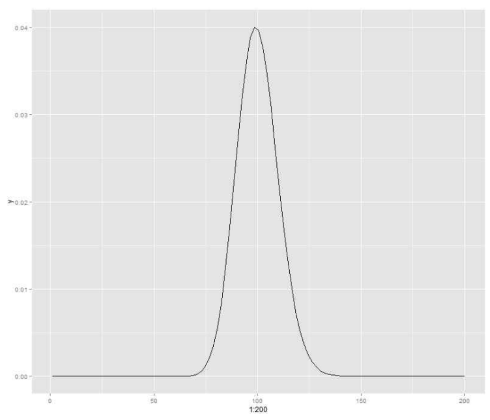

1. 한 연구자가 서울대 학교 심리학과 교수들에 대하여 관심이 있다.
(1) sample space를 정의하고, 그 space의 elementary events를 기술하라
- Sample space: 서울대 심리학 교수 전체
예로 학과에 교수 5명이 있다면, $S={P_1, P_2, P_3, P_4, P_5}$
- elementary events: 집단 내 교수 한 명
예로 각 교수를 $P_i$라고 하면, $E_i={P_i}$, where $i=1,2,...,5$
즉, 각각의 event는 특정 교수가 선택되는 단일한 event

(2) sample space 상에서 random variable을 하나 정의 하고, 그 variable의 확률 분포를
생각하여 보라.
- Define random variable: $X(P_i)=\text{교수 }P_i\text{의 연구 경력}$

- 확률분포
  - $X(P_1)=5$, $X(P_2)=10$, $X(P_3)=15$, $X(P_4)=20$, $X(P_5)=25$
  - 현재 N이 적으므로 단순 나열

(3) 이때 expected value와 variance를 구하라.
- $E(X) = (5+10+15+20+25)/5 = 15$
- $Var(X) = ((5-15)^2+(10-15)^2+(15-15)^2+(20-15)^2+(25-15)^2)/5 = 50$

---

2. 우리가 인간의 지능을 연구하고 있다. 이때 random variable을 정의하고, 의미있는 statistic을 하나 만들어 보아라. 이 statistic의 분포는 무엇인가. (필요하면 random variable에 대한 가정을 만들어도 됨).
- Random Variable X = 개인의 IQ 점수
  - $X \thicksim N(100, 15^2)$
- Statistic $\bar{X} = \Sigma X_i / n$
- Distribution of Statistic
  - $\bar{X} \thicksim N(100, 15^2/n)$
  - n이 커질 수록 분산은 작아지고 평균 추정의 정확도는 높아진다.

---

3. Central Limit Theorem이란 무엇인가? 왜 통계학에서 중요한가?

- CLT
	- 표본의 크기가 충분히 크다면, 어떤 분포에서 추출한 표본의 평균은 '정규분포'에 가까워진다
	- 임의의 분포에서 독립적으로 추출된 n개의 표본 X_1, X_2, ..., X_n의 평균 $\bar{X}$가 주어졌을 때, n이 충분히 크다면 표본 평균의 분포는, 그 원래 분포의 형태와 상관없이 모집단의 평균이 $\mu$, 분산이 $\sigma^2/n$인 정규분포에 가까워진다.
	- $\bar{X} \thicksim N(\mu, \sigma^2/n)$
- Why?
  - 모집단이 정규분포가 아니더라도, 표본 크기만 충분히 크다면 그 표본 평균은 정규분포를 따르기에,  "다양한 분포에서 정규성을 보장"
  - 신뢰구간 계산처럼 정규분포를 기반으로 하는 "추정과 가설 검정이 가능"하게 됨

4. Standard error of σ가 말이 되지 않는 이유는?
- 표준오차(SE) 표준편차($\sigma$)는 서로 다른 개념. 
  - 표준편차: 모집단 또는 "표본의 데이터"가 평균에서 얼마나 흩어져 있는지 나타내는 "산포도"의 측정값
    - $\sigma = \sqrt{\cfrac{\Sigma (X_i-\mu)^2}{N}}$
	- N: 모집단의 크기
  - 표준오차: 표본 "통계량의 변동성". 표본에서 추출된 통계량(평균, 비율 등)이 어떻게 변동할 지 설명하는 것.
    - $SE(\bar{X}) = \sigma/\sqrt{n}$
	- n: 표본 크기

---

5. 가설검정에서 p=.0001이고 alpha가 .005이다. 각각의 숫자의 의미를 설명하고 이들의 수에서 어떠한 결론을 내릴 수 있는가?

	
	
- 정의
	- alpha
	  - Type 1 Error: 참인데 잘못하여 기각할 확률
	  - 연구자가 true인 null hypothesis를 기각할 오류를 범할 최대 허용치(유의수준(significance level))
	- p-value
	  - 관찰된 데이터가 null hypothesis 하에서 나올 확률. 즉, true null hypothesis일 때 현재의 데이터뿐만 아니라 그보다 극단적인 데이터를 얻을 확률

- 의미
  - $\alpha=0.005$: 참인걸 잘못하여 기각할 확률을 0.5%로 설정했다
  - $p=0.0001$: null hypothesis가 ture라는 가정 하에, 관찰된 데이터가 나올 확률이 0.01%에 "불과"하다. (매우 낮은 확률이니, true일 가능성이 매우 낮다)
  
- 해석
  - p-value < alpha: Reject $H_0$
  - p-value > alpha: Accpet $H_0$

- 결론:
  - p-value(0.0001) < alpha(0.005): Reject $H_0$

---

6. μ의 OLS Estimate와 Maximum Likelihood Estimate는 무엇인가? 두 추정치는 개념적으로 어떻게 다른가?
- 공통점: 데이터에서 모수(예로 평균)를 추정
- 정의
  - OLS: $\min \Sigma(y_i - \hat{y_i})^2$
    - OLS는 주로 정규성, 독립성, 등분산성 등의 가정 하에 수행
  - MLE: $\max \log P(X|\theta)$
    - $\theta$는 추정할 모수(예로 평균)
	- 데이터가 "특정 분포"를 따른다고 가정

- 개념적 차이
  - 추정의 원리:
    - OLS: 데이터와의 거리(잔차)의 제곱을 최소화하여 추정값을 도출합니다.
    - MLE: 데이터가 관찰될 확률을 최대화하여 파라미터를 추정합니다.
  - 모형 가정:
    - OLS: 주로 선형 회귀 모델에 적용되며, 잔차가 정규 분포를 따른다는 가정이 필요
    - MLE: 다양한 분포에 적용 가능하나, 데이터의 분포를 가정해야 함. 예를 들어, 정규분포일 경우 MLE와 OLS의 결과가 일치할 수 있음
  - 최적화의 목표:
    - OLS: 잔차의 제곱합을 최소화하는 것을 목표로 합니다.
    - MLE: 가능도를 최대화하여 파라미터를 추정합니다.

---

7. 평균에 대한 신뢰구간이 [1000, 1500]이었다. 이를 해석하라.
- 평균이 신뢰구간인 [1000, 1500]에 있을 가능성이 높다

+) 신뢰구간: $[\bar{X}-1.96 \cdot \sigma / \sqrt{n}, \ \bar{X}+1.96 \cdot \sigma / \sqrt{n}]$
  - 무수히 많은 표본을 보유해있으며, 각 표본에 대해 신뢰구간을 구하였을 때, 그 신뢰구간 중 95%가 파라미터를 포함하고 있다.

---

8. $S=Σ(X_i- \bar{X})/N$ 과 $S=Σ(X_i- \bar{X})/(N-1)$의 차이를 설명하라.
- 왼쪽은 biased estimator of $\sigma$
- It's biased estimator: $E(S^2) = \cfrac{n-1}{n}\sigma^2 < \sigma^2$
  - $S^2$은 $\sigma^2$을 n이 작을 수록 더 심하게 과소추정
- 오른쪽은 unbiased estimator
  - $s^2=\cfrac{n}{n-1}S^2=Σ(X_i- \bar{X})/(N-1)$
  - $E(s^2)=\sigma^2$

---

9. $X_1, X_2, X_3, ..., X_n$ ~ iid $B(N,p)$
이때 이항분포의 확률함수 (probability function)을 f(X)라 하자.
다음의 확률을 표시하라. $P(X 1 and X 6)=$

- 이항분포의 확률함수: $f(k; N, p) = P(X = k) = \binom{N}{k} p^k (1-p)^{N-k}$
  - k: 성공횟수, N: 총횟수, p: 성공확률, $\binom{N}{k}$: 조합
  - $P(X_1) = f(k_1; N, p) = \binom{N}{k_1} p^{k_1} (1-p)^{N-k_1}$
  - $P(X_6) = f(k_6; N, p) = \binom{N}{k_6} p^{k_6} (1-p)^{N-k_6}$
- 이항분포이므로 모든 사건이 독립적이기에 곱셈 가능
  - $P(X_1 \text{ and } X_6) = P(X_1) \cdot P(X_6)$
- 결론: $=P(X_1) \cdot P(X_6) = f(k_1; N, p) \cdot f(k_6; N, p)$

---

10. 철수는 국회의원의 90%가 남자인 것을 발견하였다. 그래서 자기는 남자이기 때문에 국회의원이 될 확률이 높다고 이야기 한다. 이 결론에 대해 논하라.
- 확률의 의미
  - 철수가 관찰한 사실은 "국회의원 중 90%가 남자"라는 통계입니다. 이는 모집단의 성별 분포를 나타내지만, 개인의 확률과는 다릅니다.
  - 개인이 국회의원이 될 확률은 성별 외에도 다양한 요인(정치적 경험, 지지 기반, 선거 과정 등)에 영향을 받습니다.
- Bayes' Theorem:
  - $P(B|A) = \cfrac{P(A|B)P(B)}{P(A)}$
  - 4칸 표가 주어진다면 $P(성별=M|국회의원=O)=0.90$을 이용하여 
  - $P(국회의원=O|성별=M)=\cfrac{P(성별=M|국회의원=O)\cdot P(국회의원=O)}{P(성별=M)}$

---

11. 제약회사에서 두 종류의 약을 개발하였다. 이 회사는 두 약 (A, B)의 효과가 같은지 다
른 지를 연구하고자 한다. 두 약을 각각 100명에게 투약한 후 그 약효를 측정하였다.

(1) 다음의 자료들을 이용하여 가설검정의 절차를 따를 때, 어떠한 결론을 내릴 수 있다.
- A약의 약효: 평균 $\bar{X}_a = 100$ 표준편차 20
- B약의 약효: 평균 $\bar{X}_b = 105$ 표준편차 15
- $\hat{σ}_{\bar{X}_a}=2$, $\hat{σ}_{\bar{X}_b}=1.5$
- $t(99; α=.05)=1.99$

(2) 위에서 내린 결론에 대한 우리가 저지를 수 있는 판단 오류는 무엇이고, 어느 정도 된다고 생각하나?

- (1)
  - $H_0: \mu_A = \mu_B$
    - 평균의 크고 낮음의 방향성이 아닌 '일치' 여부이므로 'Two-Tailed test'
  - $\hat{σ}_{\bar{X}_a-\bar{X}_b}=\sqrt{\cfrac{\sigma^2_A}{N_A}+\cfrac{\sigma^2_B}{N_B}}=2.5$ ?
  - $t=\cfrac{\bar{X}_a-\bar{X}_b}{\hat{\sigma}_{\bar{X}_a-\bar{X}_b}}=\cfrac{100-105}{2.5}=-2$
    - A의 평균이 B의 평균보다 작다는 것을 나타낸다?
  - $df = n_A + n_B = 100 + 100 - 2 = 198$
  - 결론: t-value of two tailed test
    -  $|-2| > 1.99$: Reject $H_0$ 
    - 두 약의 효과가 서로 다르다

- (2)  
  - Type I Error: 두 약의 효과가 같음에도 불구하고 기각하여 다르다고 결론 내리는 오류
    - significance level $\alpha=0.05$이므로 Type I Error를 저지를 확류은 5%
  - Type II Error: power를 계산할 effect size에 대한 추가 정보가 필요함

---

12. [Gamma 분포를 배우지 않았지만, 가설검증을 이해하고 그 논리를 따르면 쉽게 풀 수 있는
문제]

당신은 작은 가게를 운영하고 있는데 최근 고객의 수가 늘어난 것 같아서, 이를 통계적으로 검증하려고 한다. 그동안 1분에 평균 1명의 고객이 방문하고 있었다. 오늘 100명의 고객이 방문할 때까지 시간을 측정하니 80분이 소요되었다. 오늘의 고객의 수가 통계적으로 유의하게 늘었는지를 검증하려한다. 다음의 사실을 고려하라.
- 1분에 평균 $\beta$명의 고객이 방문할 때, 100명의 고객이 방문할 때까지 걸리는 시간을 무선변수 X로 잡았을 때, X는 gamma 분포를 따르고 파라미터는 $\beta$이다. 아래의 그래프는 $\beta=1$인 gamma 분포의 확률밀도함수이다.

위의 감마분포에서 계산된 확률은 다음과 같다.
- $P(X<80)=0.017$
- $P(X<100)=0.513$

정 답(답하네 정말)
- 1분에 1명 오면 누구나 100분에 100명 오겠지 했는데 80분 밖에 안 걸려서 흐뭇한 주인장. 과연 손님이 늘고 있는 게 맞는 걸까?
- Hypothesis
  - $H_0: \lambda=1$ 
    - 1분에 평균 1명 방문: 고객 수 변동 X
  - $H_1: \lambda>1$
    - 1분에 평균 1명보다 많이 방문: 고객 수 증가
- Hypothesis Test
  - 주어진 정보
    - 고객 수 n=100, 관측된 시간 X=80,
    - $X \thicksim \Gamma(n=100, \lambda=1)$
  - 유의수준 $\alpha=0.05$로 정했을 때 $P(X<80) = 0.017$은 그보다 낮으므로 Reject $H_0$
- 결론: 고객 수의 평균이 1보다 많다
