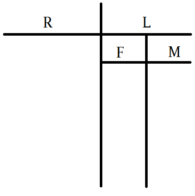

|                                                                                                                                                                                     |                                                                                                                                                                                                     |                                                                                                                                                                                                    |
| ----------------------------------------------------------------------------------------------------------------------------------------------------------------------------------- | --------------------------------------------------------------------------------------------------------------------------------------------------------------------------------------------------- | -------------------------------------------------------------------------------------------------------------------------------------------------------------------------------------------------- |
| - before -> b/f - after -> a/f - because -> b/c                                                                                                                               | - through -> thru. - with -> w/ - without -> w/o                                                                                                                                              | - years -> yrs - something -> sth. - somebody -> sby.                                                                                                                                        |
|                                                                                                                                                                                     |                                                                                                                                                                                                     |                                                                                                                                                                                                    |
| - positive -> posit. - negative -> **neg.** - effective- > effec. - difficult -> diffic. - convenient -> conveni. - original -> origin. - impossible -> impossib. | - problem -> prob. - evidence -> evid. - condition -> condi. - structure -> struct. - company -> comp. - knowledge -> knwlge. - equipment -> equip. - presentation -> present. | - population -> ppl. - experiments -> experi. - experience -> exp. - traditional -> trad. - transportation -> transp. - capacity -> capa. - activity -> act. - system -> sys. |
|                                                                                                                                                                                     |                                                                                                                                                                                                     |                                                                                                                                                                                                    |
| - advertise -> ad. - building -> build.                                                                                                                                          | - professional -> pro. - professor -> prof.                                                                                                                                                      | - require -> req. - requirement -> require.                                                                                                                                                     |
| - advantage -> adv. - disadvantage -> X adv.                                                                                                                                     | - opposite -> opp. - opinion -> oppo.                                                                                                                                                            | - community -> comm. - communication -> commun.                                                                                                                                                 |
|                                                                                                                                                                                     |                                                                                                                                                                                                     |                                                                                                                                                                                                    |
| - economy -> econ. - ecosystem -> eco. - environment -> **environ.** - business -> biz. - chemical -> chem. - biology -> bio.                                        | - insufficient -> insuffic. - immediate -> immedi. - malfunctioning -> malfunc. - horizontal -> horiz. - vulnerable -> vulner. - worthwhile -> worth.                                | - eliminate -> elimi. - artifical -> artifi. - illumination -> illumin. - recreation -> rec. - teenage -> teen.                                                                        |
|                                                                                                                                                                                     |                                                                                                                                                                                                     |                                                                                                                                                                                                    |
|                                                                                                                                                                                     |                                                                                                                                                                                                     |                                                                                                                                                                                                    |
| - lecture -> lec. - scholarship -> sch. - student -> stud. - subject -> subj.                                                                                              | - Stockholm -> Stock.                                                                                                                                                                               | - subconscious -> subconsc. - vegetation -> vege. 초목 - organism -> org.                                                                                                                      |
|                                                                                                                                                                                     |                                                                                                                                                                                                     |                                                                                                                                                                                                    |

# Consonants: drop aeiou

https://tstprep.com/articles/toefl/taking-notes-for-the-listening-section-of-the-toefl-test/

https://toefltestprep.com/blog/helpful-abbreviations-for-speedy-note-taking

- sleep -> slp
- symptoms -> smptms
- depression -> dprsn
- anxiety -> anxty
- create -> crete
- common -> cmn
- disorder -> dsrdr

# Symbols
- $+$ : benefit, positive / also, as well / together, combine
- $\empty$ : not, no / negative / stop
- $?$ : I'm not sure / question

# What info: Things you ... write down
- could: relatively easy to remember, so don’t have to write
- should: important info. 
- must: important info. & difficult to remember

# Section

