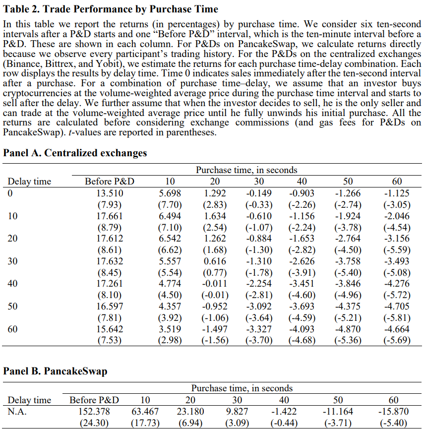
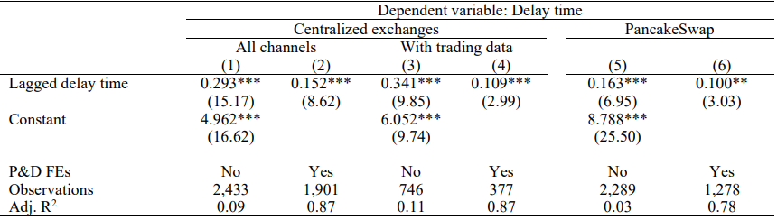
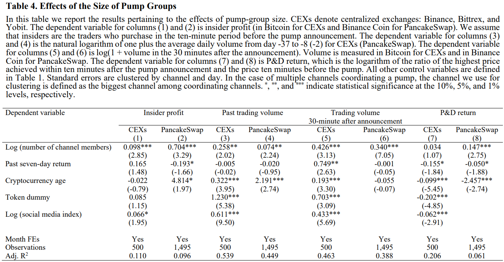
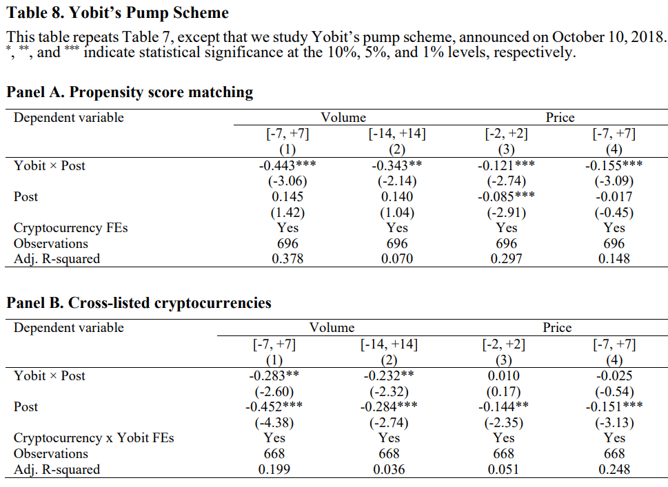

---

title: "Cryptocurrency Pump-and-Dump Schemes"
date: "Sep 2018, (Oct 2023)"
author:
	name: "Tao Li, Donghwa Shin, and Baolian Wang"
excerpt: "Pump-and-dump(P&D) scheme, manipulation, forensic finance, cryptocurrency, overconfidence, gambling"

---

> Summary: P&D scheme is that prices peak within minutes and quick reversals follow. As price manipulation in traditional stock market, gambling and overconfident investors often participate in P&D in cryptocurrency market. It leads to wealth transfer between insider and outsider.

# 1. Traditional Literature

Classification of price manipulation (Allen and Gale, 1992)

- Information-based manipulation
- Action-based manipulation
- Trade-based manipulation -> This Paper!

# 2. Terminology

- Emoji
  - 🪙 == in cryptocurrency market
  - 📜 == in stock market
- P&D: Pump and Dump
  - prices peak within minutes and quick reversals follow
- Pump Group: P&D 주도 집단.
  - 계획한 pump를 Telegram을 통해 광고하여 investor 모집
  - target date, time, exchange를 예정된 날짜에서 최소 하루 전에 미리 공지. But Not disclose "target cryptocurrency"
  - 정기적으로 참여하는 멤버들의 매수가 큰 폭의 가격 상승을 유발
- Premium Membership (Tiered access)
  - 어떤 pump group은 특정 insider에게 미리 알림
- naïve reinforcement learning: Heuristic updating
  - if win, then stay, else switch
- wash trading: -> 잘못된 시장 정보를 생성하고자, 팔자마자 즉시 같은 asset 매수

# 3. Difference with Stock market

- P&D episode lasts for ...
  - 🪙 several minutes
  - 📜 months
  - (Aggarwal and Wu, 2006; Hacketal et al., 2019)
- False information release or company action related to P&D
  - 🪙 No (not exist)
  - 📜 Yes (exist) -> in order to manipulation
  - (Aggarwal and Wu, 2006; Putnins, 2012; Hackethal et al., 2019)
- Engage in ...
  - 🪙 manipulation
    - resulted from anonymity of new encryption tech
  - 📜 informed trading
  - (Mahoney, 1999; Jiang, Mahoney, and Mei, 2005)

# 4. Contribution

### 4-1. Pattern of target chosen by pump groups

- To hide and make target unpredictable,
  - Only a small number of exchanges (weak KYC)
  - Being targeted again
- Unlike 📜 loves smallest stocks,
  - 🪙 A wide range of cryptocurrency, particularly medium-sized CRSP stocks
- Specifically, bigger pump groups
  - target bigger and more liquid one -> earn higher profits

### 4-2. Puzzle: Participation of Outsider

- target price가 P&D 시작 몇 분 전부터 가격 상승 조짐을 보이기에 이러한 pump signal을 systematically 감지한 outsider도 수익을 봄.

### 4-3. Overconfident investors -> victims -> Gambling

- (Scheinkman and Xiong, 2003; Daniel and Hirshleifer, 2015)
- (Barberis and Huang, 2008; Barberis, 2013; Bordalo, Gennaioli, and Shleifer, 2012, 2013)
- -> Fraud -> Lose trust in market -> So, P&D should be regulated

# 5. Data

- a list of P&D events
  - CEX (Sep, 2018 ~) 120 Telegram groups
    - 1,040 P&D on Binance, Bittrex, Yobit
  - DEX (Jan, 2022 ~) 151 Telegram groups
    - PancakeSwap ~ get each trader's wallet address
- trading data
  - CEX: Binance API, Kaiko Data (daily) (2014 ~ )
  - DEX: Binance Smart Chain
- additional cryptocurrency-level variables
  - coinmarketcap.com (BitcoinTalk)
    - daily price (volume-weighted across exchanges), total volume, mktcap
  - cryptocompare.com
    - crypto SNS from reddit, X, facebook

# 6. Results

- Positive trade performance until 10~20 sec
  

- Persistent advantages for certain telegram channels
  

- Effect of the size of pump groups & cryptocurrency age
  

- Pump Scheme
  
