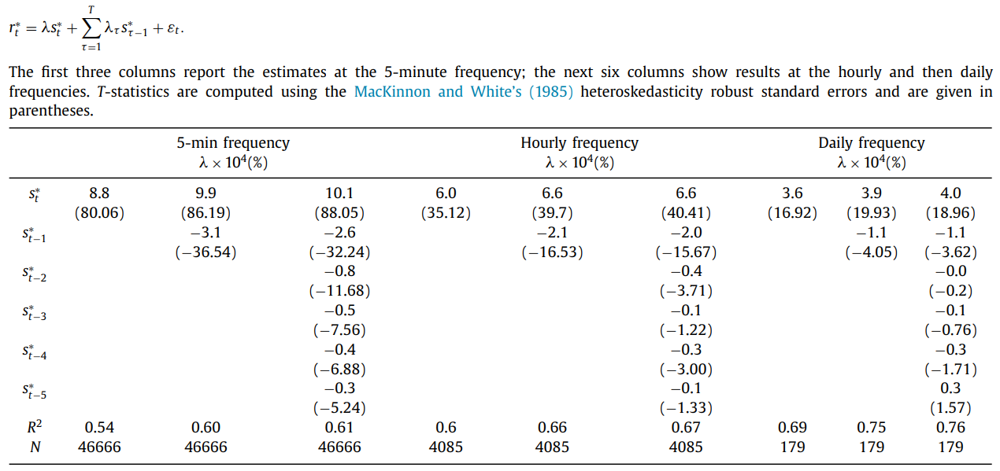
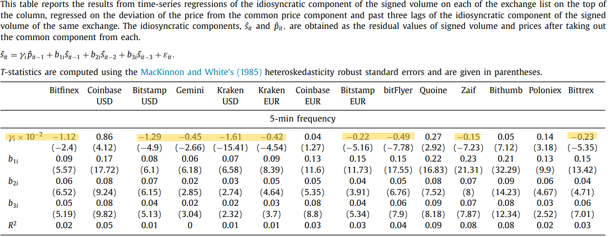
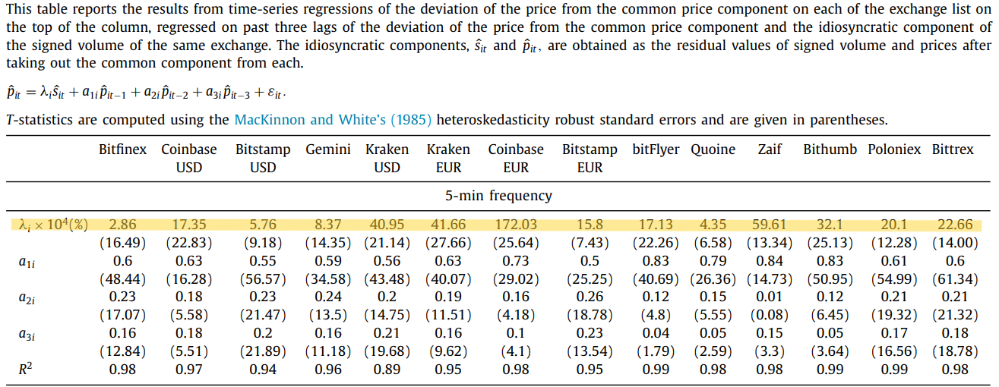

# Trading and Arbitrage in Cryptocurrency Markets

## Makarov & Schoar (2020)

## Journal of Financial Economics

---

### 📈 Motivation

- In cryptocurrency markets,
- **Price Deviation** are much larger **across** than within countries
- ! **Capital Control** for the movement of arbitrage capital

### 📊 Experiments

- **30+ exchanges**, 2013–2018, minute‐level trades and quotes
- **Countries with higher bitcoin premia** over the US bitcoin price see **widending** arbitrage deviations **when bitcoin appreciates**

### 💡 Identification

- **Idiosyncratic components explain arbitrage spreads btw exchanges** by decomposing signed vol on each exchange into common & idiosyncratic comp.

---

### 🧮 Methodology for Price Impact

1. **Decompose order flow & returns**
   - Signed volume decomposition: $s_{it} = \bar s_i + \beta^s_i\,s^*_t + \hat s_{it}$ with orthogonality $E[s^*_t]=E[\hat s_{it}]=E[s^*_t\hat s_{it}]=0$
   - Return decomposition: $r_{it} = \bar r_i + \beta^r_i\,r^*_t + \hat r_{it}$ with $E[r^*_t]=E[\hat r_{it}]=E[r^*_t\hat r_{it}]=0$
2. **Extract common factors**
   - $s^*_t = \sum_i w^s_i (s_{it}-\bar s_i)$
   - $r^*_t = \sum_i w^r_i (r_{it}-\bar r_i)$,
   - subject to $\sum_i w^s_i\beta^s_i = \sum_i w^r_i\beta^r_i =1$
3. **Price–flow regression**: $r^*_t = \lambda\,s^*_t + \varepsilon_t$
   - $\lambda$: aggregation `price impact` per unit flow

---

### 📋 (+) Table: Price Impact -> Extract Lambda

1. \$10,000 BTC's BUY volume ⬆️ -> 9% increase in price on avg
2. Negative Lag of signed vol -> Persistance of price impact

---

### 🧮 Methodology for the Idiosyncratic Price Pressure by VAR

1. For Signed Volume
   $\hat s_{it}
\;=\;
\gamma_i\,\hat p_{i,t-1}
\;+\;
b_{1i}\,\hat s_{i,t-1}
\;+\;
b_{2i}\,\hat s_{i,t-2}
\;+\;
b_{3i}\,\hat s_{i,t-3}
\;+\;
\varepsilon_{it}$

2. For Price
   $\hat p_{it}
\;=\;
\lambda_i\,\hat s_{i,t}
\;+\;
a_{1i}\,\hat p_{i,t-1}
\;+\;
a_{2i}\,\hat p_{i,t-2}
\;+\;
a_{3i}\,\hat p_{i,t-3}
\;+\;
\varepsilon_{it}$

---

### 📋 Table: Idiosyncratic Signed Volume ~ [Arbitrage: Sell High]

Negative $\gamma$) $\text{price}_i > \text{price}_{global} \Rightarrow \text{Reversed Net Order Flow}_i$

---

### 📋 Table: Idiosyncratic Return ~ [Demand Determines Price]

Positive $\lambda$) $\Delta \text{NetVol}_i \Rightarrow \Delta \text{Price}_i$

