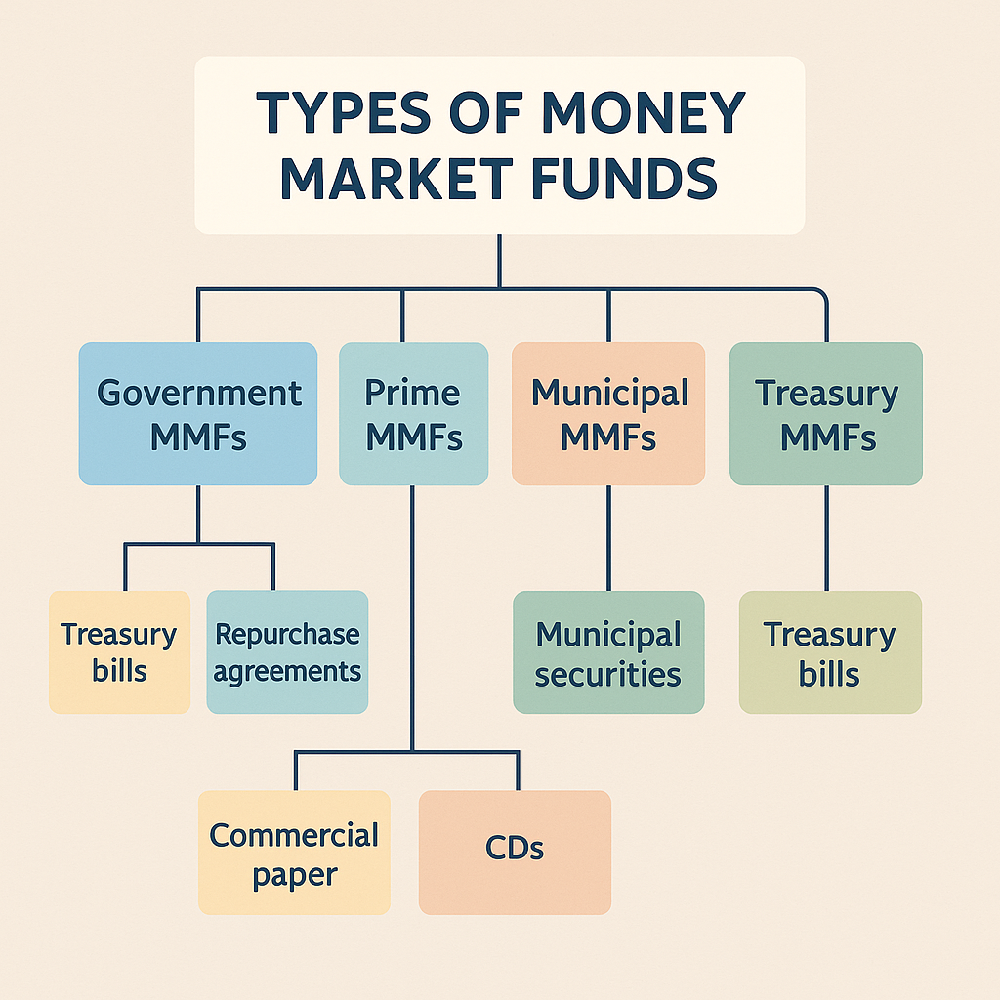
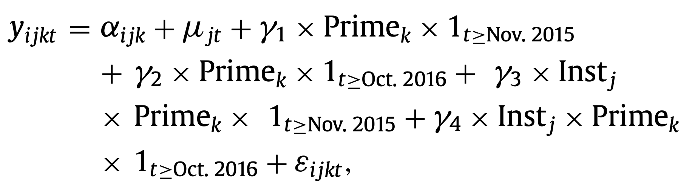
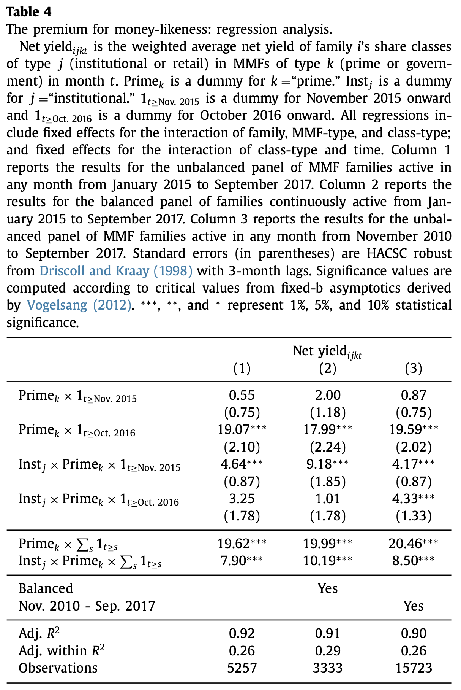
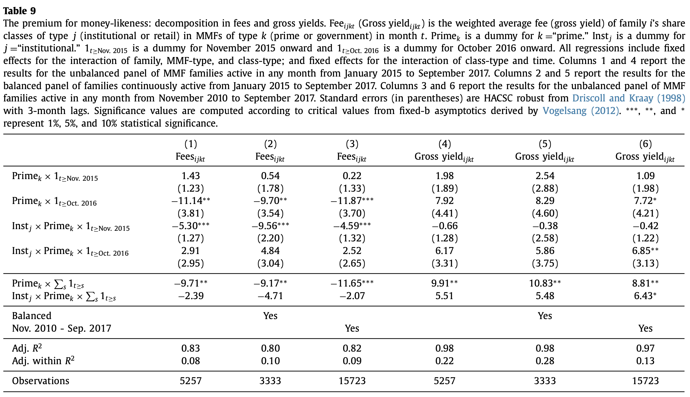
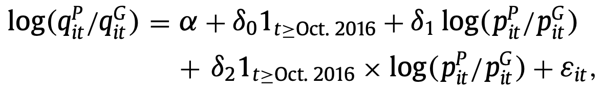
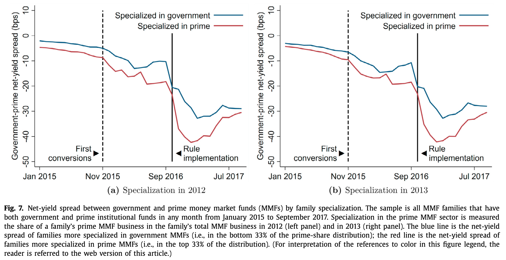
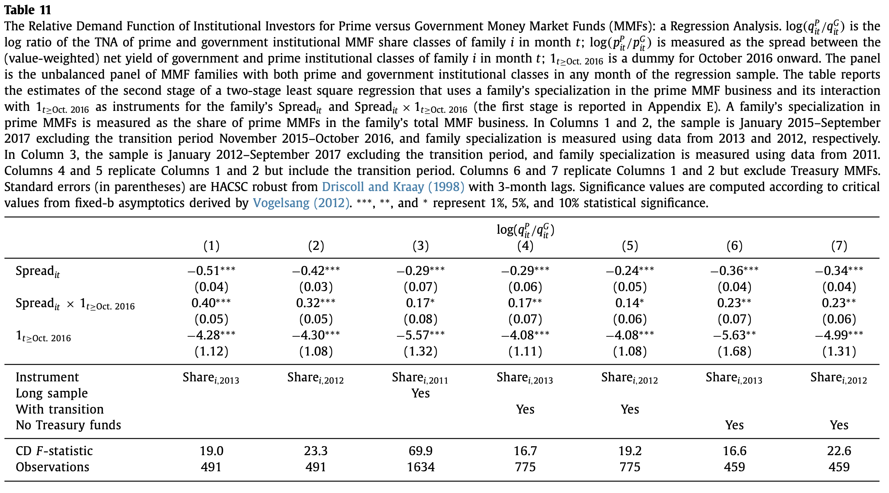

# Investors’ appetite for money-like assets:

# The MMF industry after the 2014 regulatory reform

## Marco Cipriani, Gabriele La Spada

Federal Reserve Bank of New York Research Group

JFE 2021 (Received 2 February 2019)

---

## Outline

- Background
- Motivation
- Contribution & Key Methodology
- Result
  1. Premium for money-likeness
  2. Elasticity of Substitution b/w Prime & Gov MMF

<!-- - Methodology
- Data (skip)
- Results -->

---

## Background 1: Nonexistent Risk Free, But...

- Exists via combination of a market of people willing to buy the risk asset
- Distribute raw commodity $\implies$ Distribute Risk of the Commodity 

<!-- By "Money without boundaries: How Blockchain Will Facilitate the Decentralization of Money" by Thomas J. Anderson, Piliar 2 - The Credit Theory of Money, 2021 -->

---

## Background 2: MMF(Money Market Fund)

- Pegged to $1 per share, MMFs are a type of mutual fund that invests in short-term, low-risk securities

---

## Background 3: 2014 SEC Regulatory Reform

##### Enhanced Disclosure Requirements

- The reform mandated liquidity fees and redemption gates for prime MMF (not gov MMF), additionally floating NAV only for ***institutional prime MMFs***
  - ***Floating NAV***: Round to the nearest 1/1000 of a cent for the asset value of the fund, instead of at a $1.00 stable share price
  - ***Gate***: fine liquidity fees or suspending redemptions temporarily when fund's weekly liquid assets fall below a certain threshold

- https://www.sec.gov/newsroom/press-releases/2014-143

---

## Motivation from title

- ***money-like asset*** = MMF is not risk free. It has non-zero volatility like asset
- 2014 ***regulatory reform*** = for adverse selection b/w inst and retail investors
- ***Investors' appetite***:  = Premium of money-likeness for risk aversion

---

## Contribution

- Define feature of money-like assets, information insensitivity
- Estimate the premium for money-likeness even assets supplied by the private sector
  - By exploiting a exogenous change (SEC Reform)

## Methodology
- Difference-in-Difference
  - Treatment: Prime MMF
  - Control: Government MMF

---

## Result 1: Premium for Money-Likeness

- $y_{ijkt}$: W.Avg Net Yield of MMF
  - $k \in \{prime(1), \ government(0) \}$

  - $j \in \{inst, \ retail\}$ : Share classes

  - $i$: Family = Same investment bank

  - $t$: Month
    - $1_{t \geq Nov. \ 2015}$: ***started to react***  
    - $1_{t \geq Oct. \ 2016}$: the ***regulation onward***

---

## Result 1+: Value of Info. Insensitivity in Fee and Gross Yield

Increase in Net-Yield spread 
- $\impliedby$  Decrease in Fee 
- $\impliedby$  Increase in Gross-yield spread or both

---

## Result 2: Elasticity of Substitution b/w Prime & Gov MMF

MMF Investor's Relative Demand for Prime vs Gov MMF

- $q$: TNA(total net asset) of the Funds 
  - from diff of yield $\Delta y$: 
    - treat MMF share as zero coupon bond \$1 face value $p=\cfrac{1}{1+y}$
- $p$: W.Avg Prices
  - Log form means $Spread_{it}$

---

## Result 2: Elasticity of Substitution b/w Prime & Gov MMF
2LSR
  - To instrument for the time-varying endogenous relative price
  - Use familiy specialization in prime MMFs from a pre-sample period
    - MMF Specialization: how concentrated an MMF family’s business 

---

## Result 2: Elasticity of Substitution b/w Prime & Gov MMF

---

# Fin.