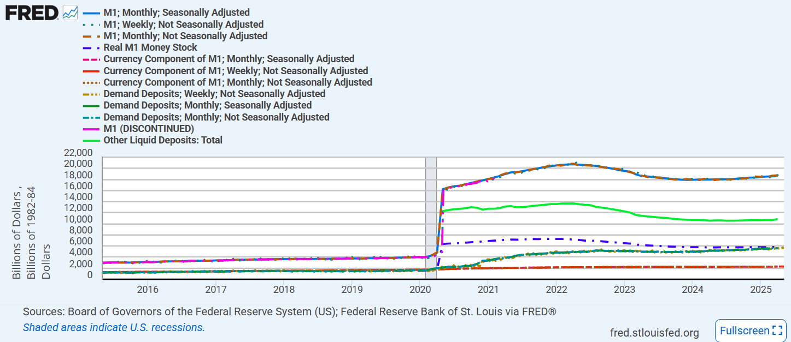
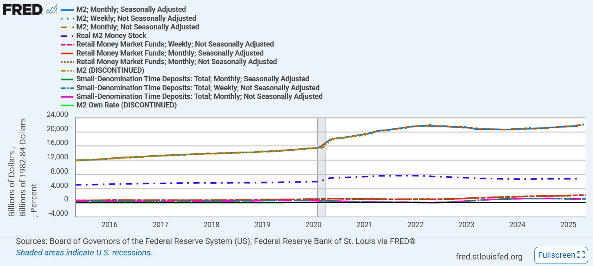
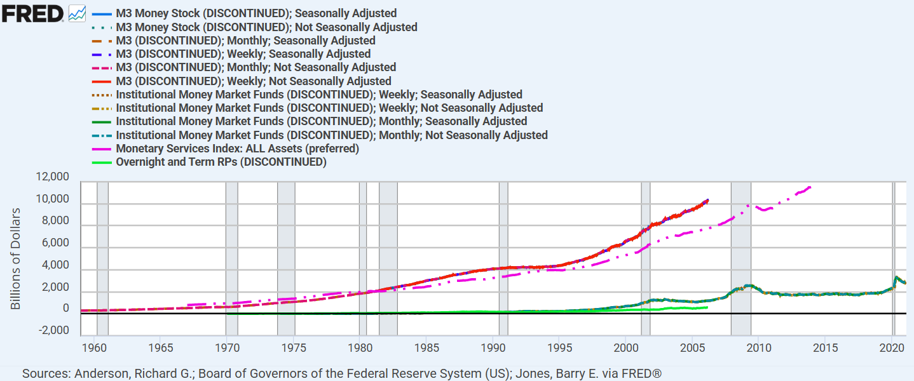
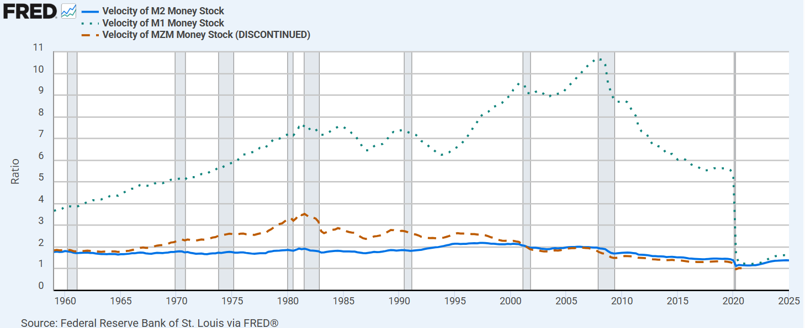
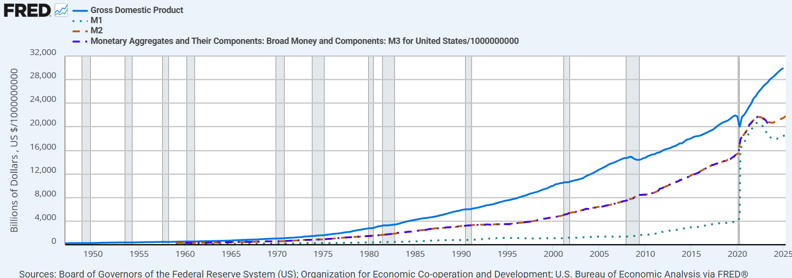

# Money 

---

## Types of Money

- **M1**: Currency and coins in circulation + checking account in banks
  - **\$100** in wallet (M1)
  - **\$1,000** in checking account (M1)

- **M2**: + savings account in banks + MMF + short-term commercial paper + treasury bills
  - **\$1,000** in savings account (M2) 
  - **\$10,000** in money market fund (M2)

Total money supply is **\$12,100**

---
<!--commercial banks (except held by depository institutions, the U.S. government, and foreign banks and official institutions) -->
## Components of M1 (M1SL)

  

1. M0 = ***currency in circulation*** in the form of bills and coins (w/o in Fed & bank vaults)

2. Currency outside the U.S. Treasury, FRB, & vaults of depository institutions

3. Demand deposits at commercial banks (except cash items in the process of collection and Federal Reserve float)

4. Changed ***after May 2020***
- Pre: OCDs$^1$, consisting of 
  - NOW$^2$ & ATS$^3$ accounts at depository institutions
  - share draft(checks) accounts at credit unions
  - demand deposits at thrift institutions
- Post: OCDs$^1$ + ***savings deposits*** (including MMDA$^4$)

1. other checkable deposits
2. negotiable order of withdrawal
3. automatic transfer service
4. money market deposit accounts
 

---

## U.S Narrow Money M1

---

## Components of M2 (M2SL)

1. M1 

2. small-denomination **time deposits**$^1$ except IRA$^2$ and Keogh balances$^3$ at depository institutions

3. balances in **retail MMFs** except IRA and Keogh balances at MMFs

1. amount less than \$100,000 but higher interest rate
2. individual **retirement** account
3. Keogh plan is a tax-advantaged **retirement** plan **for self-employed** individuals and small business owners
 

---

## U.S Narrow Money M2

---

## US Broad Money M3 

---

## US Money Velocity 

- Calculated ratio = Nominal GDP / Avg of M(?) money stock

---

## Nominal GDP and Money Stock

- Similar trajectory b/w M2 and M3 
- M1 surged at 2020 (by adding saving accounts)

---

## Reference

- Board of Governors of the Federal Reserve System (US), M1 [M1SL], retrieved from FRED, Federal Reserve Bank of St. Louis; https://fred.stlouisfed.org/series/M1SL, May 30, 2025. 
- https://corpgov.law.harvard.edu/2023/08/22/the-secs-money-market-fund-reforms/